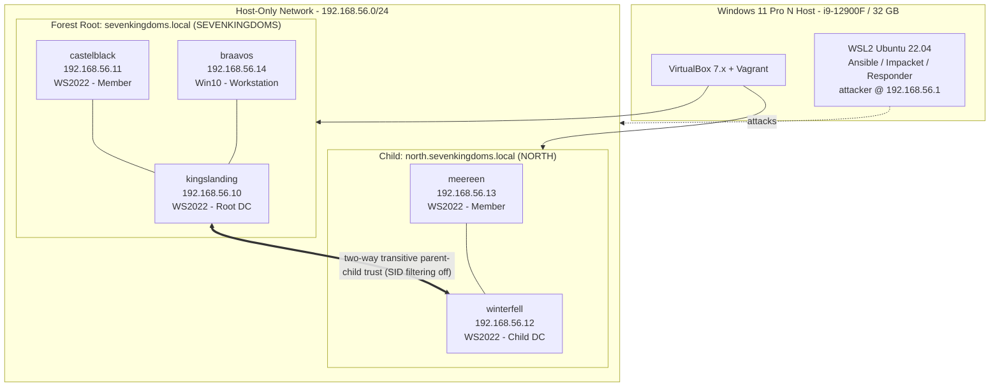

# AD Attack & Detection Lab — *Seven Kingdoms*


A from-scratch, **GOAD-equivalent Active Directory lab** built as portfolio work: two domains in one forest joined by a parent-child trust, five VMs, ~25 Game-of-Thrones–themed users, and a deliberately vulnerable configuration. It ships ten end-to-end **attack walkthroughs**, a matching **detection catalog** (Microsoft Sentinel KQL + Sigma + Splunk/Elastic), a **hardening guide**, and a professional **pentest write-up** — the full offensive → detection → defensive loop.

> ⚠️ **Intentionally insecure.** Every credential is `Password123!`, SMBv1/NTLMv1/LLMNR are on, and delegation and ACLs are misconfigured *on purpose*. Run it only on an isolated host-only network (`192.168.56.0/24`). Never expose these VMs to a routable network.

---

## Table of Contents

- [Architecture](#architecture)
- [VM Inventory](#vm-inventory)
- [Quick Start](#quick-start)
- [Documentation](#documentation)
- [Attack Catalog](#attack-catalog)
- [Detection Catalog](#detection-catalog)
- [MITRE ATT&CK Mapping](#mitre-attck-mapping)
- [Hardening & Write-up](#hardening--write-up)
- [Assumptions](#assumptions)
- [Repository Layout](#repository-layout)
- [Credits & License](#credits--license)

---

## Architecture



See [docs/01-lab-architecture.md](docs/01-lab-architecture.md) for the network topology, trust model, OU structure, and resource budget.

## VM Inventory

| Hostname | IP | OS | Role | Domain | vCPU / RAM |
|----------|-----|-----|------|--------|-----------|
| **kingslanding** | 192.168.56.10 | Windows Server 2022 | Forest root **DC** | sevenkingdoms.local | 4 / 4 GB |
| **castelblack** | 192.168.56.11 | Windows Server 2022 | Member server | sevenkingdoms.local | 2 / 3 GB |
| **winterfell** | 192.168.56.12 | Windows Server 2022 | Child **DC** | north.sevenkingdoms.local | 4 / 4 GB |
| **meereen** | 192.168.56.13 | Windows Server 2022 | Member server | north.sevenkingdoms.local | 2 / 3 GB |
| **braavos** | 192.168.56.14 | Windows 10 Enterprise | Workstation | sevenkingdoms.local | 2 / 4 GB |

**Domains:** `sevenkingdoms.local` (NetBIOS `SEVENKINGDOMS`) + child `north.sevenkingdoms.local` (NetBIOS `NORTH`), two-way transitive parent-child trust.
**Domain Admins:** `tywin.lannister` (sevenkingdoms), `eddard.stark` (north). **Total footprint:** 14 vCPU / 18 GB.

## Quick Start

```bash
git clone <this-repo> ad-lab && cd ad-lab
# 1. Prepare the host (disable Hyper-V, install VirtualBox/Vagrant/WSL2/Ansible)
#    -> docs/00-environment-setup.md
# 2. Bring up the forest
vagrant up
# 3. Smoke-test the network
netexec smb 192.168.56.10-14
```

Full 15-minute walkthrough: [docs/02-quick-start.md](docs/02-quick-start.md).

## Documentation

| Doc | Purpose |
|-----|---------|
| [00 — Environment Setup](docs/00-environment-setup.md) | Win 11 Pro N preflight: disable Hyper-V, install VirtualBox 7.x (SHA256-verified), Vagrant, WSL2, Ansible |
| [01 — Lab Architecture](docs/01-lab-architecture.md) | VM-by-VM build, network topology, trust model, OU/domain structure |
| [02 — Quick Start](docs/02-quick-start.md) | 15-minute getting-started for a fresh clone |
| [03 — Troubleshooting](docs/03-troubleshooting.md) | Common errors across VirtualBox, Vagrant, Ansible/WinRM, domain join, attack tools |
| [04 — Cleanup & Reset](docs/04-cleanup-and-reset.md) | Snapshot management, restore, teardown, post-attack reset |

## Attack Catalog

Ten end-to-end walkthroughs. Each has prerequisites, versioned tools, per-host commands, literal expected output, screenshot placeholders, cleanup, defensive insight, and a link to its detection query.

| # | Attack | MITRE | Key Tools | Detection |
|---|--------|-------|-----------|-----------|
| 01 | [BloodHound Enumeration](attacks/01-bloodhound-enumeration.md) | [T1087.002](https://attack.mitre.org/techniques/T1087/002/) | SharpHound, BloodHound CE 6.x | [KQL §1](detection/kql-queries.md#1-bloodhound-enumeration) |
| 02 | [Kerberoasting](attacks/02-kerberoasting.md) | [T1558.003](https://attack.mitre.org/techniques/T1558/003/) | Rubeus 2.3.2, Impacket 0.12.0, hashcat 6.2.6 | [KQL §2](detection/kql-queries.md#2-kerberoasting) |
| 03 | [AS-REP Roasting](attacks/03-asrep-roasting.md) | [T1558.004](https://attack.mitre.org/techniques/T1558/004/) | Impacket GetNPUsers, Rubeus, hashcat | [KQL §3](detection/kql-queries.md#3-as-rep-roasting) |
| 04 | [NTLM Relay](attacks/04-ntlm-relay.md) | [T1557.001](https://attack.mitre.org/techniques/T1557/001/) | Responder, Impacket ntlmrelayx | [KQL §4](detection/kql-queries.md#4-ntlm-relay) |
| 05 | [Pass-the-Hash](attacks/05-pass-the-hash.md) | [T1550.002](https://attack.mitre.org/techniques/T1550/002/) | Impacket psexec, netexec | [KQL §5](detection/kql-queries.md#5-pass-the-hash) |
| 06 | [DCSync](attacks/06-dcsync.md) | [T1003.006](https://attack.mitre.org/techniques/T1003/006/) | Mimikatz 2.2.0, Impacket secretsdump | [KQL §6](detection/kql-queries.md#6-dcsync) |
| 07 | [Golden Ticket](attacks/07-golden-ticket.md) | [T1558.001](https://attack.mitre.org/techniques/T1558/001/) | Mimikatz, Impacket ticketer | [KQL §7](detection/kql-queries.md#7-golden-ticket) |
| 08 | [Silver Ticket](attacks/08-silver-ticket.md) | [T1558.002](https://attack.mitre.org/techniques/T1558/002/) | Rubeus 2.3.2, Mimikatz | [KQL §8](detection/kql-queries.md#8-silver-ticket) |
| 09 | [Unconstrained Delegation](attacks/09-unconstrained-delegation.md) | [T1550.003](https://attack.mitre.org/techniques/T1550/003/) / [T1187](https://attack.mitre.org/techniques/T1187/) | Rubeus monitor, SpoolSample | [KQL §9](detection/kql-queries.md#9-unconstrained-delegation-abuse) |
| 10 | [Cross-Forest Trust Abuse](attacks/10-cross-forest-trust-abuse.md) | [T1134.005](https://attack.mitre.org/techniques/T1134/005/) / [T1558.001](https://attack.mitre.org/techniques/T1558/001/) | Mimikatz (SID History / trust key) | [KQL §10](detection/kql-queries.md#10-cross-forest-trust-abuse) |

## Detection Catalog

| Source | File | Owner |
|--------|------|-------|
| **Microsoft Sentinel (KQL)** | [detection/kql-queries.md](detection/kql-queries.md) — 10 queries, one per attack | docs track |
| Sigma rules | [detection/sigma-rules/](detection/sigma-rules/) | infra track |
| Sysmon config | [detection/sysmon-config.xml](detection/sysmon-config.xml) | infra track |
| Splunk SPL | [detection/splunk-queries.md](detection/splunk-queries.md) | infra track |
| Elastic / KQL-ES | [detection/elastic-queries.md](detection/elastic-queries.md) | infra track |

Each KQL query documents its log source, MITRE mapping, expected lab match count, false-positive scenarios, and production tuning guidance.

## MITRE ATT&CK Mapping

| Tactic | Technique(s) | Lab Coverage |
|--------|--------------|--------------|
| Discovery | [T1087.002](https://attack.mitre.org/techniques/T1087/002/) Account Discovery: Domain Account | BloodHound |
| Credential Access | [T1558.003](https://attack.mitre.org/techniques/T1558/003/) Kerberoasting · [T1558.004](https://attack.mitre.org/techniques/T1558/004/) AS-REP Roasting · [T1003.006](https://attack.mitre.org/techniques/T1003/006/) DCSync | Kerberoasting, AS-REP, DCSync |
| Collection / MITM | [T1557.001](https://attack.mitre.org/techniques/T1557/001/) LLMNR/NBT-NS Poisoning & SMB Relay | NTLM Relay |
| Lateral Movement | [T1550.002](https://attack.mitre.org/techniques/T1550/002/) Pass the Hash · [T1550.003](https://attack.mitre.org/techniques/T1550/003/) Pass the Ticket | PtH, Unconstrained Delegation |
| Persistence / PrivEsc | [T1558.001](https://attack.mitre.org/techniques/T1558/001/) Golden Ticket · [T1558.002](https://attack.mitre.org/techniques/T1558/002/) Silver Ticket · [T1134.005](https://attack.mitre.org/techniques/T1134/005/) SID-History Injection | Golden, Silver, Cross-Forest |
| Initial Access (coercion) | [T1187](https://attack.mitre.org/techniques/T1187/) Forced Authentication | Printerbug coercion |

## Hardening & Write-up

- 🛡️ [hardening/hardening.md](hardening/hardening.md) — Tier 0/1/2 admin model, Protected Users, LAPS, SMB/LDAP signing, Kerberos armoring (FAST), Authentication Policies & Silos, gMSA, AES-only Kerberos, ACL remediation. Each control: rationale, impact, MITRE mitigation, validation, blast radius, and an effort/impact matrix.
- 📄 [writeup/writeup.md](writeup/writeup.md) — professional pentest report: executive summary, methodology (CIS v8 / NIST 800-115 / ATT&CK), 10 findings with CVSS 3.1 ratings, detection gap analysis, and a 30/60/90 hardening roadmap.
- 🎤 [interview-prep/interview-prep.md](interview-prep/interview-prep.md) — elevator pitch, 20 Q&A (5 surface + 15 deep technical), reflection, and a STAR behavioral answer.

## Assumptions

Decisions made where the spec was ambiguous (e.g. the attacker host model, SPN-to-host mapping, intra-forest vs. cross-forest framing) are logged in [ASSUMPTIONS.md](ASSUMPTIONS.md).

## Repository Layout

```
ad-lab/
├── README.md                     <- you are here
├── ASSUMPTIONS.md                <- decision log
├── .gitignore
├── docs/                         <- setup, architecture, quick start, troubleshooting, cleanup
│   ├── 00-environment-setup.md
│   ├── 01-lab-architecture.md
│   ├── 02-quick-start.md
│   ├── 03-troubleshooting.md
│   └── 04-cleanup-and-reset.md
├── attacks/                      <- 10 attack walkthroughs (01-10)
├── detection/
│   ├── kql-queries.md            <- 10 Sentinel KQL queries (docs track)
│   ├── sigma-rules/              <- infra track
│   ├── sysmon-config.xml         <- infra track
│   ├── splunk-queries.md         <- infra track
│   └── elastic-queries.md        <- infra track
├── hardening/hardening.md
├── writeup/writeup.md
├── interview-prep/interview-prep.md
├── screenshots/                  <- evidence (naming: attack-N-step-M.png)
└── infrastructure/               <- Vagrantfile + Ansible + PowerShell (infra track)
```

## Credits & License

GoT-themed AD lab inspired by [GOAD (Orange Cyberdefense)](https://github.com/Orange-Cyberdefense/GOAD). Built for educational and portfolio use. Licensed under **MIT**. Use only against systems you own or are authorized to test.

---
Last updated: 2026-05-17
MITRE ATT&CK: <https://attack.mitre.org/> · CIS Controls v8 · NIST SP 800-115
