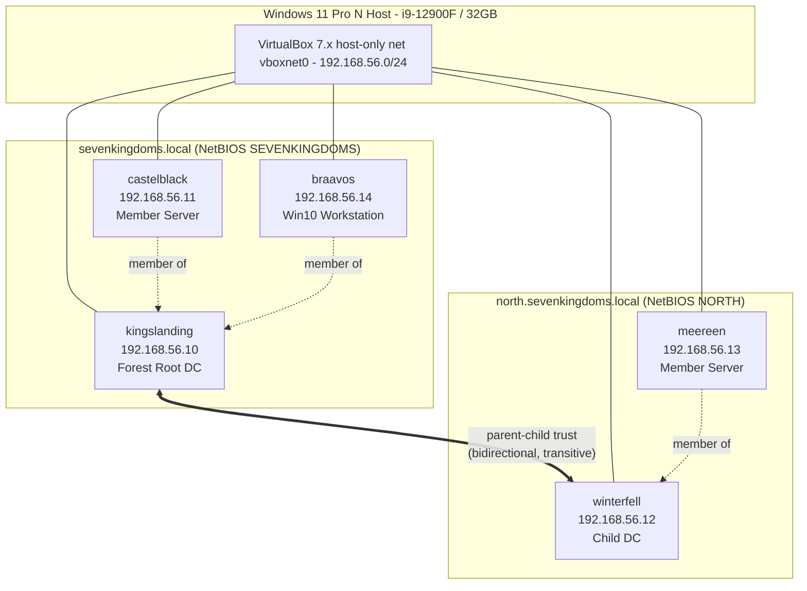
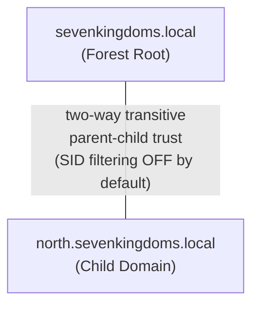
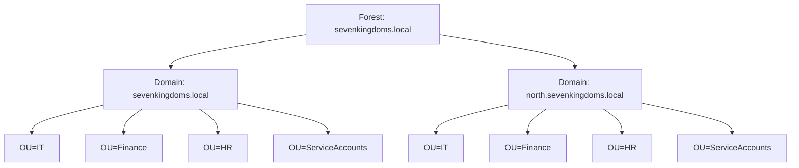

# 01 — Lab Architecture

> **Scope:** The full topology of the GoT-themed Active Directory portfolio lab: VMs, networking, domains, trusts, OUs, and resource budget.
> Codex's `Vagrantfile` (in [`/infrastructure/`](../infrastructure/)) references this document as the canonical source for hostnames, IPs, and resource sizing — keep them in lockstep.

Related docs: [Environment Setup](00-environment-setup.md) · [Quick Start](02-quick-start.md) · [Troubleshooting](03-troubleshooting.md) · [Cleanup & Reset](04-cleanup-and-reset.md)

---

## 1. VM Inventory

| Hostname | IP | OS | Role | Domain | vCPU | RAM |
|----------|-----|----|------|--------|------|-----|
| **kingslanding** | 192.168.56.10 | Windows Server 2022 | Forest root DC | sevenkingdoms.local | 4 | 4 GB |
| **castelblack** | 192.168.56.11 | Windows Server 2022 | Member server | sevenkingdoms.local | 2 | 3 GB |
| **winterfell** | 192.168.56.12 | Windows Server 2022 | Child domain DC | north.sevenkingdoms.local | 4 | 4 GB |
| **meereen** | 192.168.56.13 | Windows Server 2022 | Member server | north.sevenkingdoms.local | 2 | 3 GB |
| **braavos** | 192.168.56.14 | Windows 10 Enterprise | Workstation | sevenkingdoms.local | 2 | 4 GB |

Lab password (all accounts unless noted): `Password123!` → use `{{LAB_PASSWORD}}` in generic snippets.

---

## 2. Network Topology

- **Subnet:** `192.168.56.0/24` — VirtualBox **host-only** adapter (`vboxnet0`). No NAT exposure; the lab is isolated from the corporate/home LAN.
- **DNS:** Each member/workstation points at its domain's DC. `north.*` machines resolve up to `kingslanding` via a conditional forwarder / delegation for cross-domain name resolution.
- **DCs:** `kingslanding` (forest root) and `winterfell` (child).



---

## 3. IP Scheme & Hostname Conventions

| Convention | Rule |
|------------|------|
| Subnet | `192.168.56.0/24` (host-only, VirtualBox reserved range) |
| Host adapter | `vboxnet0` typically `192.168.56.1` |
| DHCP | Disabled — all VMs use **static** IPs assigned by Vagrant/Ansible |
| Address block | `.10`–`.14` for the five lab VMs; `.100+` reserved for future attacker boxes (Kali/Parrot) |
| Hostnames | GoT locations, lowercase, no domain suffix in the NetBIOS name (e.g. `kingslanding`) |
| DCs | Always end in `.10` (root) / `.12` (child) for muscle memory |

---

## 4. Domains & Trust Relationships

- **Forest root:** `sevenkingdoms.local` — NetBIOS `SEVENKINGDOMS`.
- **Child domain:** `north.sevenkingdoms.local` — NetBIOS `NORTH`.
- **Trust:** Automatic **parent-child trust** created when `winterfell` is promoted into the forest.
  - **Direction:** Bidirectional (two-way).
  - **Transitivity:** Transitive — flows through the forest trust tree.
  - **Type:** Intra-forest parent-child (not an external/forest trust).
- **SID filtering:** **Disabled by default** on intra-forest parent-child trusts (this is normal Windows behavior). This is intentional and material for the lab — it makes **cross-domain SID History abuse** and child-DC-to-forest-root escalation (e.g. forging a TGT with the Enterprise Admins SID via a child-domain compromise) viable attack paths. Forest/external trusts would enable SID filtering by default; parent-child does not.



### Privileged accounts

| Account | Domain | Privilege |
|---------|--------|-----------|
| `tywin.lannister` | sevenkingdoms.local | Domain Admins (root) |
| `eddard.stark` | north.sevenkingdoms.local | Domain Admins (north) |

> Enterprise Admins lives in the **root** domain (`sevenkingdoms.local`). Compromising the child (`winterfell`) and abusing the trust to reach Enterprise Admins is a core attack-path demonstration — see [`/attacks/`](../attacks/).

---

## 5. OU & Object Structure

Each domain contains the same four OUs plus 25+ GoT-themed users distributed across them, with `ServiceAccounts` hosting Kerberoastable SPN-bearing accounts.

```text
sevenkingdoms.local
├── OU=IT              (e.g. tyrion.lannister, varys)
├── OU=Finance         (e.g. petyr.baelish)
├── OU=HR              (e.g. cersei.lannister)
└── OU=ServiceAccounts (e.g. svc-sql, svc-iis  -> SPNs, Kerberoast targets)

north.sevenkingdoms.local
├── OU=IT              (e.g. robb.stark, samwell.tarly)
├── OU=Finance         (e.g. catelyn.stark)
├── OU=HR              (e.g. sansa.stark)
└── OU=ServiceAccounts (e.g. svc-backup, svc-mssql -> SPNs)
```



> Total user count is **25+** across both domains. Service accounts deliberately carry SPNs and weak passwords to seed Kerberoasting/AS-REP roasting exercises.

---

## 6. Total Resource Footprint vs Host Budget

| VM | vCPU | RAM |
|----|------|-----|
| kingslanding | 4 | 4 GB |
| castelblack | 2 | 3 GB |
| winterfell | 4 | 4 GB |
| meereen | 2 | 3 GB |
| braavos | 2 | 4 GB |
| **Total allocated** | **14 vCPU** | **18 GB** |
| **Host budget** | 24 threads | 32 GB |
| **Headroom** | 10 threads | 14 GB (minus ~8 GB if WSL2 is capped per `.wslconfig`) |

CPU is **oversubscription-safe** (14 of 24 logical threads). RAM allocation of 18 GB leaves ~14 GB; if WSL2 is capped at 8 GB (see [Environment Setup §4b](00-environment-setup.md#4b-wslconfig-host-side-userprofilewslconfig)), the host OS + browser still has ~6 GB — adequate but tight, so avoid running all five VMs *and* a heavy GPU hashcat job simultaneously.

> **Disk:** 367 GB free on the host. Budget roughly 30–50 GB per Windows guest after provisioning + snapshots; the five-VM lab plus one `clean-provisioned` snapshot set lands around 180–220 GB. Plan disk cleanup via [Cleanup & Reset](04-cleanup-and-reset.md).

---
Last updated: 2026-05-17
References: https://attack.mitre.org/ · https://attack.mitre.org/techniques/T1134/005/ (SID-History Injection) · https://attack.mitre.org/tactics/TA0008/ (Lateral Movement)
