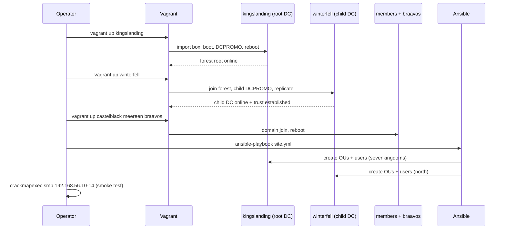

# 02 — Quick Start (≈15 Minutes of Hands-on Time)

> **Goal:** Get from a freshly cloned repo to a fully provisioned, two-domain AD lab and a green smoke test.
> **Note on timing:** ~15 min of *your* time; total wall-clock is ~45–75 min because Windows promotion + replication runs unattended.

Related docs: [Environment Setup](00-environment-setup.md) · [Lab Architecture](01-lab-architecture.md) · [Troubleshooting](03-troubleshooting.md) · [Cleanup & Reset](04-cleanup-and-reset.md)

---

## Prerequisites

Complete the host preflight first: **[00 — Environment Setup](00-environment-setup.md)**.
You need: Hyper-V hypervisor off (`bcdedit ... hypervisorlaunchtype Off`), VirtualBox 7.x + Extension Pack, Vagrant + `vagrant-vbguest`, and (optionally) WSL2 + Ansible with the `ansible.windows` / `microsoft.ad` collections.

---

## Steps

### 1. Clone the repo

```bash
git clone <your-fork-url> ad-lab
cd ad-lab
```

### 2. Verify prerequisites (2 min)

```powershell
VBoxManage --version          # 7.x.xr<build>
vagrant --version             # Vagrant 2.x.x
vagrant plugin list           # vagrant-vbguest present
bcdedit /enum | Select-String hypervisorlaunchtype   # -> Off
```

If any check fails, jump back to [Environment Setup](00-environment-setup.md). The host-only adapter and `networks.conf` allowlist must already be in place.

### 3. `vagrant up` (longest unattended step)

The Vagrantfile lives in [`/infrastructure/`](../infrastructure/). Bring the DCs up **first** so child promotion and member joins can find them.

```powershell
# Recommended order: forest root -> child DC -> members -> workstation
vagrant up kingslanding
vagrant up winterfell
vagrant up castelblack meereen braavos
```

Approximate per-VM timing (first run, includes base box import + Windows boot):

| VM | Role | First-boot time |
|----|------|-----------------|
| kingslanding | Root DC (DCPROMO + reboot) | ~12–18 min |
| winterfell | Child DC (waits for root, replicates) | ~12–18 min |
| castelblack | Member join | ~6–9 min |
| meereen | Member join | ~6–9 min |
| braavos | Win10 workstation join | ~6–9 min |

> Domain promotion reboots the guest mid-provision; `vagrant up` reconnecting over WinRM is normal. If it stalls on *"Waiting for domain"*, see [Troubleshooting](03-troubleshooting.md).

### 4. Provision with Ansible

If the Vagrantfile delegates user/OU/GPO creation to Ansible (rather than inline PowerShell), run the play after the boxes are joined:

```bash
cd infrastructure/ansible
ansible-playbook -i inventory.ini site.yml
# PLAY RECAP
# kingslanding : ok=NN changed=NN unreachable=0 failed=0
# winterfell   : ok=NN changed=NN unreachable=0 failed=0
```

This seeds the IT / Finance / HR / ServiceAccounts OUs and the 25+ GoT users in both domains.

### 5. Smoke test

From the host (or attacker box on `192.168.56.0/24`):

```bash
# Sweep all five hosts — confirms SMB up + domain names
crackmapexec smb 192.168.56.10-14
# SMB  192.168.56.10  445  KINGSLANDING  [*] Windows Server 2022 (domain:sevenkingdoms.local) (signing:True)
# SMB  192.168.56.12  445  WINTERFELL    [*] Windows Server 2022 (domain:north.sevenkingdoms.local)

# Authenticated check with a Domain Admin
crackmapexec smb 192.168.56.10 -u tywin.lannister -p '{{LAB_PASSWORD}}' -d sevenkingdoms.local
# [+] sevenkingdoms.local\tywin.lannister:Password123! (Pwn3d!)
```

RDP for interactive work:

```powershell
mstsc /v:192.168.56.10   # log in as sevenkingdoms\tywin.lannister / {{LAB_PASSWORD}}
```

### 6. Where to go next

- Attack walkthroughs (Kerberoast, AS-REP, SID History / cross-trust escalation): [`/attacks/`](../attacks/)
- Detection engineering (Sysmon, Windows event IDs, hunting): [`/detection/`](../detection/)
- Hardening guidance: [`/hardening/`](../hardening/)
- When something breaks: [Troubleshooting](03-troubleshooting.md)
- Reset between exercises: [Cleanup & Reset](04-cleanup-and-reset.md)

---

## Timeline



---

## What Success Looks Like (Checklist)

- [ ] `vagrant status` shows all 5 VMs **running**.
- [ ] `crackmapexec smb 192.168.56.10-14` returns 5 hosts; `.10` shows `sevenkingdoms.local`, `.12` shows `north.sevenkingdoms.local`.
- [ ] Authenticated CME as `tywin.lannister` returns `(Pwn3d!)` on `.10`.
- [ ] RDP to `kingslanding` succeeds with the Domain Admin.
- [ ] `Get-ADTrust -Filter *` on `kingslanding` shows the two-way trust to `north.sevenkingdoms.local`.
- [ ] Both domains contain the IT / Finance / HR / ServiceAccounts OUs and 25+ users total.
- [ ] At least one snapshot named `clean-provisioned` exists (see [Cleanup & Reset](04-cleanup-and-reset.md)).

---
Last updated: 2026-05-17
References: https://attack.mitre.org/ · https://attack.mitre.org/tactics/TA0007/ (Discovery) · https://attack.mitre.org/techniques/T1021/001/ (RDP)
