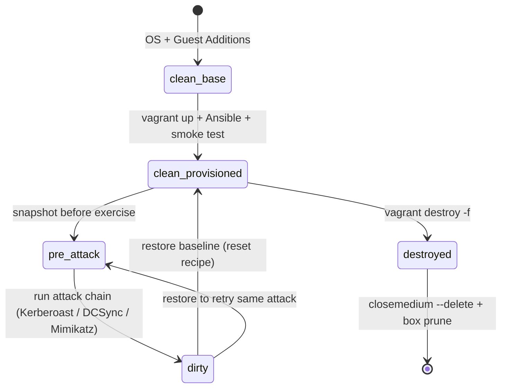

# 04 — Cleanup & Reset

> Snapshot strategy, restore procedures, teardown, disk reclamation, and a one-command "reset after an attack" recipe so every exercise starts from a known-good baseline.

Related docs: [Environment Setup](00-environment-setup.md) · [Lab Architecture](01-lab-architecture.md) · [Quick Start](02-quick-start.md) · [Troubleshooting](03-troubleshooting.md)

---

## 1. Snapshot Naming Convention

Snapshots are cheap; confusion is expensive. Use a consistent vocabulary:

| Snapshot name | Taken when | Purpose |
|---------------|-----------|---------|
| `clean-base` | After OS install + Guest Additions, **before** domain join | Rebuild a VM without re-importing the box |
| `clean-provisioned` | After `vagrant up` + Ansible completes, smoke test green | **The canonical baseline.** Restore here between exercises |
| `pre-attack-<name>` | Right before running a specific attack chain | Roll back a single experiment |
| `detection-baseline` | After Sysmon + logging configured, no attack run yet | Clean telemetry for detection tuning |

> **Golden rule:** snapshot **all five VMs at the same moment** under the same name. AD machine-password and Kerberos state is cross-VM; restoring one VM to an older point than the others breaks secure channels and causes clock skew (see [Troubleshooting Phase 4](03-troubleshooting.md#phase-4--windows-domain-join--ad)).

---

## 2. Creating Snapshots

```powershell
# Per-VM
vagrant snapshot save kingslanding clean-provisioned
vagrant snapshot save winterfell   clean-provisioned
vagrant snapshot save castelblack  clean-provisioned
vagrant snapshot save meereen      clean-provisioned
vagrant snapshot save braavos      clean-provisioned

# List what exists
vagrant snapshot list
```

> Best practice: take the snapshot while VMs are **powered off or freshly booted and idle** to capture consistent AD/replication state. Optionally `vagrant halt` first, snapshot, then `vagrant up`.

---

## 3. Restore Procedures

```powershell
# Restore one VM
vagrant snapshot restore kingslanding clean-provisioned

# Restore the whole lab to baseline (run for every VM, same name)
foreach ($vm in 'kingslanding','winterfell','castelblack','meereen','braavos') {
    vagrant snapshot restore $vm clean-provisioned --no-provision
}
```

After a multi-VM restore, validate health:

```powershell
vagrant status
# then on a DC:
#   repadmin /replsummary
#   w32tm /resync
#   Test-ComputerSecureChannel   (on members, if join looks broken)
```

---

## 4. Selective Per-VM Teardown

Rebuild a single misbehaving VM without nuking the lab:

```powershell
# Destroy just one box
vagrant destroy braavos -f

# Recreate it (will re-provision + re-join the domain)
vagrant up braavos
```

> If you destroy a **member** and recreate it, its computer account in AD is reused/reset on rejoin. If you destroy a **child DC** (`winterfell`), you must also clean up its metadata on the root DC (`ntdsutil` metadata cleanup) before re-promoting, or replication will complain.

---

## 5. Full Teardown

```powershell
# Stop everything
vagrant halt

# Destroy all VMs defined in the Vagrantfile (no prompt)
vagrant destroy -f
```

This removes the VMs but may leave behind base boxes, orphaned virtual disks, and the host-only network.

---

## 6. Reclaiming Disk & Host Cleanup

```powershell
$VBM = "$env:ProgramFiles\Oracle\VirtualBox\VBoxManage.exe"

# 1. Find any orphaned/leftover disks
& $VBM list hdds

# 2. Release + delete a leftover medium (use the UUID from the list)
& $VBM closemedium disk <UUID> --delete

# 3. Remove old/unused Vagrant base boxes
vagrant box list
vagrant box prune          # removes outdated box versions

# 4. Remove the host-only network when fully done with the lab
& $VBM list hostonlyifs
& $VBM hostonlyif remove vboxnet0
```

> Recreate `vboxnet0` later via `VBoxManage hostonlyif create` (and re-allowlist `192.168.56.0/21` in `networks.conf` per [Setup §7](00-environment-setup.md#7-troubleshooting)) before the next `vagrant up`.

Sanity-check reclaimed space (host has 367 GB total budget):

```powershell
Get-PSDrive C | Select-Object Used,Free
```

---

## 7. "Reset to Clean State After an Attack" Recipe

After a Kerberoast/DCSync/Mimikatz session, the domain is dirty (golden tickets cached, krbtgt possibly compromised, planted accounts, modified ACLs, Sysmon logs full). Fastest reliable reset:

```powershell
# 1. Halt everything to freeze state
vagrant halt

# 2. Restore ALL five VMs to the canonical baseline (same snapshot name)
foreach ($vm in 'kingslanding','winterfell','castelblack','meereen','braavos') {
    vagrant snapshot restore $vm clean-provisioned --no-provision
}

# 3. Bring the DCs up first, then members
vagrant up kingslanding
vagrant up winterfell
vagrant up castelblack meereen braavos

# 4. Re-sync time (Kerberos) and verify trust/replication
#    (on kingslanding)  w32tm /resync ; repadmin /replsummary ; Get-ADTrust -Filter *

# 5. Smoke test
#    crackmapexec smb 192.168.56.10-14
```

> If you actually compromised **krbtgt** and did NOT snapshot, the only clean fix without restore is a **double krbtgt password reset** on each domain — restoring the `clean-provisioned` snapshot set is dramatically simpler and is why we snapshot before every attack.

---

## 8. Snapshot Lifecycle



---
Last updated: 2026-05-17
References: https://attack.mitre.org/ · https://attack.mitre.org/techniques/T1003/006/ (DCSync) · https://attack.mitre.org/techniques/T1070/ (Indicator Removal)
