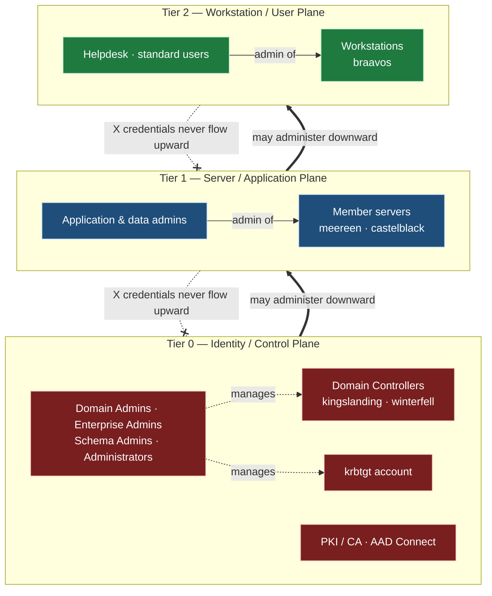
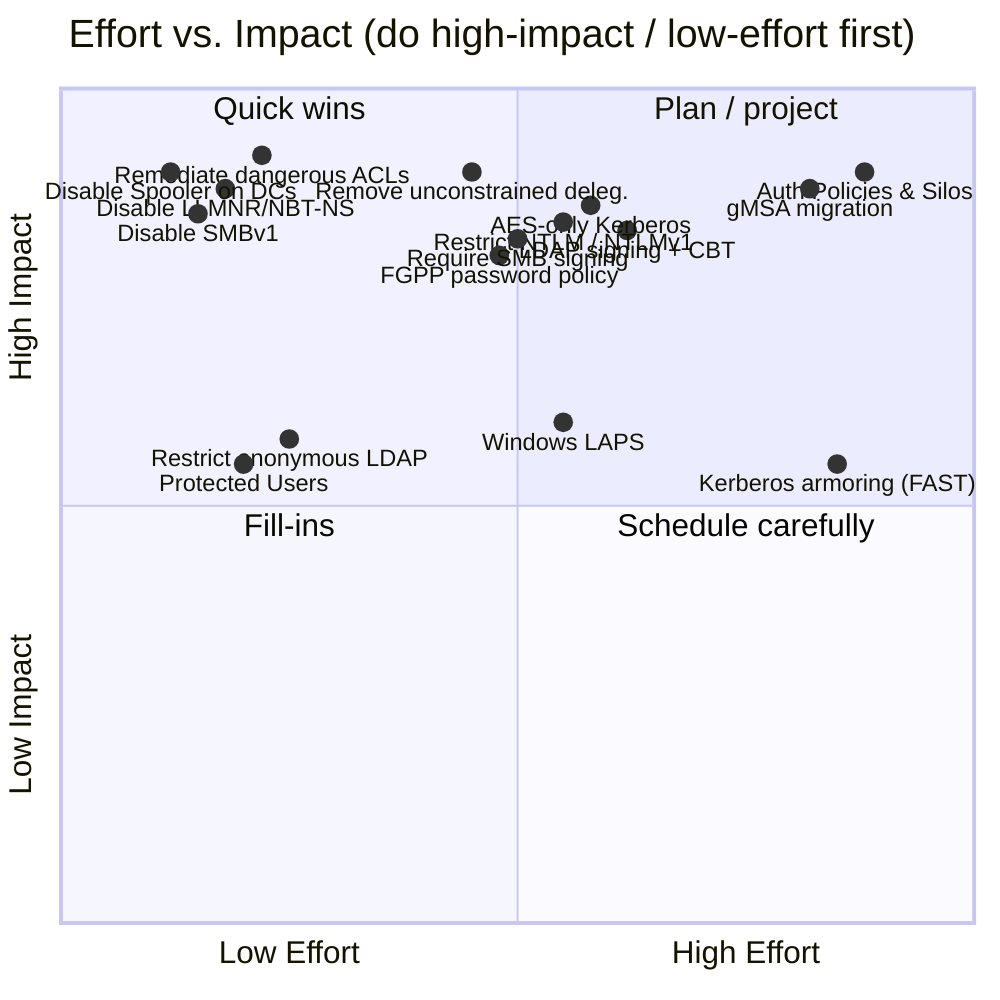

# Active Directory Hardening Guide

> Remediation plan for the **GOAD-style** portfolio lab spanning `sevenkingdoms.local` and its child `north.sevenkingdoms.local` (parent–child trust).

This guide maps each intentionally-vulnerable configuration in the lab to a concrete hardening control. Every control is documented with its rationale, operational impact, the relevant **MITRE ATT&CK Mitigation ID**, a link to the implementation script under `../infrastructure/provisioning/scripts/hardening/`, a validation method, and the blast radius if the change goes wrong.

## Lab topology being remediated

| Host | Role | Domain | IP |
|------|------|--------|----|
| `kingslanding` | Domain Controller (forest root) | `sevenkingdoms.local` | 192.168.56.10 |
| `winterfell` | Domain Controller (child) | `north.sevenkingdoms.local` | 192.168.56.12 |
| `castelblack` | Member server | `north.sevenkingdoms.local` | — |
| `meereen` | Member server | `sevenkingdoms.local` | — |
| `braavos` | Workstation (Windows 10) | `sevenkingdoms.local` | — |

Intentional weaknesses targeted: Kerberoastable RC4 SPN service accounts, AS-REP roastable users, unconstrained delegation (`cersei.lannister`, `brandon.stark`), SMBv1, NTLMv1, LLMNR/NBT-NS, Print Spooler on DCs, anonymous LDAP enumeration, a weak Finance OU password policy (8 chars, no complexity), dangerous ACLs (HR `GenericWrite` over Finance; ServiceAccounts `WriteDACL` over `tywin.lannister`; Authenticated Users `ForceChangePassword` over `sansa.stark`), and the reused lab password `Password123!`.

---

## 1. The Tier 0 / 1 / 2 administrative model

The single most important structural change is adopting a **tiered administrative model**. Credential theft attacks (Pass-the-Hash, Pass-the-Ticket, token theft) succeed because high-privilege credentials get exposed on low-trust machines. The tier model isolates credentials by the value of the assets they control.



**The core rule: credentials never flow downward-to-upward.** A Tier 0 credential (e.g. a Domain Admin) must **never** authenticate to a Tier 1 server or a Tier 2 workstation, because anything that can compromise the lower-tier host can then harvest the higher-tier credential left in memory. Administration only flows downward: Tier 0 admins may log on to Tier 0, Tier 1, and Tier 2 assets; Tier 1 admins may log on to Tier 1 and Tier 2; Tier 2 admins are confined to workstations.

**Clean source principle.** Any object is only as secure as the systems that control it. A control relationship from a less-secure system to a more-secure object (e.g. managing a DC from `braavos`) collapses the tier boundary. Therefore Tier 0 must be administered exclusively from a dedicated, hardened **Privileged Access Workstation (PAW)** that itself is a Tier 0 asset — never from a daily-driver workstation, and never via RDP that exposes the credential on the target. The Authentication Policies & Silos and Protected Users controls below are the technical enforcement of this model.

---

## 2. Hardening controls

Each subsection below remediates one or more of the lab's intentional weaknesses.

### 2.1 Protected Users security group

**Rationale.** Members of the Protected Users group cannot use NTLM, cannot use DES/RC4 Kerberos cipher suites, cannot be delegated (constrained or unconstrained), and their TGTs are limited to 4 hours with no caching of plaintext-equivalent credentials. This hard-stops Pass-the-Hash and overpass-the-hash for the lab's most sensitive accounts (`tywin.lannister`, Domain/Enterprise Admins).

**Impact.** Members can no longer authenticate via NTLM-only services, scheduled tasks storing passwords, or legacy apps. Service accounts must **not** be added (they break). Affects interactive admin logons only.

**MITRE Mitigation:** [M1026 – Privileged Account Management](https://attack.mitre.org/mitigations/M1026/) (also [M1015 – Active Directory Configuration](https://attack.mitre.org/mitigations/M1015/)).

**Implementation script:** [`../infrastructure/provisioning/scripts/hardening/add-protected-users.ps1`](../infrastructure/provisioning/scripts/hardening/add-protected-users.ps1)

**Validation.**
```powershell
Get-ADGroupMember -Identity "Protected Users" | Select-Object name,distinguishedName
# Confirm Domain Admins / tywin.lannister are present; confirm no service accounts are present.
```

**Blast radius.** If a service account or a break-glass account is mistakenly added, it loses NTLM/RC4 and delegation — potentially locking out applications or the recovery account itself. Always keep one emergency Tier 0 account **outside** the group.

---

### 2.2 Windows LAPS (local admin password rotation)

**Rationale.** A single shared local Administrator password (the lab's `Password123!`) lets one compromised host laterally move to all others. Windows LAPS randomizes and rotates each machine's local admin password, storing it in AD (or Entra), eliminating lateral movement via reused local creds.

**Impact.** Local admin passwords change automatically; admins must retrieve the current password from AD instead of memorizing it. Scripts hard-coding a local admin password break.

**MITRE Mitigation:** [M1027 – Password Policies](https://attack.mitre.org/mitigations/M1027/) (also [M1026](https://attack.mitre.org/mitigations/M1026/)).

**Implementation script:** [`../infrastructure/provisioning/scripts/hardening/deploy-windows-laps.ps1`](../infrastructure/provisioning/scripts/hardening/deploy-windows-laps.ps1)

**Validation.**
```powershell
Get-LapsADPassword -Identity braavos -AsPlainText
# Returns a unique, rotated password; confirm ms-LAPS-Password attribute is populated on the computer object.
```

**Blast radius.** Misconfigured permissions on the LAPS attributes could either expose passwords too broadly or lock admins out of retrieving them. Affects every domain-joined machine (`braavos`, `meereen`, `castelblack`).

---

### 2.3 SMB signing (require)

**Rationale.** Without required SMB signing, an attacker performing NTLM relay (via the LLMNR/NBT-NS poisoning weakness) can relay authentication to other hosts. Requiring SMB signing on clients and servers blocks SMB relay outright.

**Impact.** Slight CPU/throughput overhead. Legacy SMBv1 clients and misconfigured NAS devices that cannot sign will fail to connect.

**MITRE Mitigation:** [M1037 – Filter Network Traffic](https://attack.mitre.org/mitigations/M1037/) (also [M1041 – Encrypt Sensitive Information](https://attack.mitre.org/mitigations/M1041/)).

**Implementation script:** [`../infrastructure/provisioning/scripts/hardening/require-smb-signing.ps1`](../infrastructure/provisioning/scripts/hardening/require-smb-signing.ps1)

**Validation.**
```powershell
Get-SmbServerConfiguration | Select-Object RequireSecuritySignature, EnableSecuritySignature
Get-SmbClientConfiguration | Select-Object RequireSecuritySignature
# Both RequireSecuritySignature values must be True.
```

**Blast radius.** Any non-signing client loses file/print access. Roll out via GPO to member servers first, monitor, then enforce domain-wide.

---

### 2.4 LDAP signing + LDAP channel binding

**Rationale.** Unsigned LDAP and missing channel binding allow LDAP relay attacks (a common path to ADCS ESC8 / privilege escalation). Requiring LDAP signing and Extended Protection for Authentication (channel binding) on the DCs stops these relays.

**Impact.** LDAP clients that bind without signing/TLS (older appliances, scanners, some Linux integrations) will fail until reconfigured to use LDAPS or signed binds.

**MITRE Mitigation:** [M1015 – Active Directory Configuration](https://attack.mitre.org/mitigations/M1015/) (also [M1037](https://attack.mitre.org/mitigations/M1037/)).

**Implementation script:** [`../infrastructure/provisioning/scripts/hardening/require-ldap-signing-cbt.ps1`](../infrastructure/provisioning/scripts/hardening/require-ldap-signing-cbt.ps1)

**Validation.**
```powershell
# On kingslanding / winterfell:
Get-ItemProperty "HKLM:\SYSTEM\CurrentControlSet\Services\NTDS\Parameters" |
  Select-Object LDAPServerIntegrity, LdapEnforceChannelBinding
# LDAPServerIntegrity = 2 (require signing); LdapEnforceChannelBinding = 2 (always).
# Also monitor Directory Service event IDs 2886/2887/3039/3040 for unsigned binds.
```

**Blast radius.** Any application doing simple LDAP binds breaks domain-wide. Use event IDs 2887/3039 to find offending clients **before** enforcing.

---

### 2.5 Kerberos armoring (FAST)

**Rationale.** Kerberos Armoring (FAST) wraps AS/TGS exchanges in an encrypted channel using the machine's TGT, protecting against offline password attacks on Kerberos pre-auth (defends AS-REP roasting hardening) and Kerberoasting brute force, and enabling compound authentication.

**Impact.** Requires Windows clients/DCs that support FAST and an updated functional level. Non-supporting or non-domain clients ignore armoring; setting it to *required* will reject them.

**MITRE Mitigation:** [M1015 – Active Directory Configuration](https://attack.mitre.org/mitigations/M1015/) (also [M1032 – Multi-factor Authentication](https://attack.mitre.org/mitigations/M1032/)).

**Implementation script:** [`../infrastructure/provisioning/scripts/hardening/enable-kerberos-armoring.ps1`](../infrastructure/provisioning/scripts/hardening/enable-kerberos-armoring.ps1)

**Validation.**
```powershell
# Confirm the "KDC support for claims, compound authentication and Kerberos armoring" GPO is Enabled,
# and clients have "Kerberos client support for claims..." Enabled.
klist | Select-String "Kerberos"   # tickets should show FAST/armored flags after gpupdate + relogon
```

**Blast radius.** If set to *Always provide claims / fail unarmored* before all DCs and clients support it, legacy or cross-realm (`north` ↔ root) authentication can fail. Stage to *Supported* first.

---

### 2.6 Authentication Policies and Authentication Policy Silos

**Rationale.** This is the technical enforcement of the Tier 0 model. A Silo restricts where Tier 0 accounts (Domain/Enterprise Admins, `tywin.lannister`) can authenticate — e.g. only to DCs and the PAW — and shortens their TGT lifetime. It directly enforces "credentials never flow downward-to-upward".

**Impact.** Siloed accounts can no longer log on anywhere except the permitted hosts. Requires a PAW and correct host membership in the silo, or admins lock themselves out.

**MITRE Mitigation:** [M1026 – Privileged Account Management](https://attack.mitre.org/mitigations/M1026/) (also [M1015](https://attack.mitre.org/mitigations/M1015/), [M1018 – User Account Management](https://attack.mitre.org/mitigations/M1018/)).

**Implementation script:** [`../infrastructure/provisioning/scripts/hardening/configure-auth-policy-silos.ps1`](../infrastructure/provisioning/scripts/hardening/configure-auth-policy-silos.ps1)

**Validation.**
```powershell
Get-ADAuthenticationPolicySilo -Filter * | Select-Object Name, Enforce
Get-ADUser tywin.lannister -Properties msDS-AssignedAuthNPolicySilo |
  Select-Object name, "msDS-AssignedAuthNPolicySilo"
# Attempt a logon from a non-permitted host — it must be denied (event 4820/4768 failure).
```

**Blast radius.** Misscoping the silo can lock all Tier 0 admins out of the domain. Deploy in **audit** mode (`-Enforce $false`) first, validate, then enforce. Keep a non-siloed break-glass account.

---

### 2.7 Disable SMBv1

**Rationale.** SMBv1 is unauthenticated-relay- and worm-prone (EternalBlue/WannaCry). It has no security benefit on a modern network.

**Impact.** Pre-Windows-7/2008 clients and very old NAS/printers lose connectivity. Modern hosts are unaffected.

**MITRE Mitigation:** [M1042 – Disable or Remove Feature or Program](https://attack.mitre.org/mitigations/M1042/) (also [M1051 – Update Software](https://attack.mitre.org/mitigations/M1051/)).

**Implementation script:** [`../infrastructure/provisioning/scripts/hardening/disable-smbv1.ps1`](../infrastructure/provisioning/scripts/hardening/disable-smbv1.ps1)

**Validation.**
```powershell
Get-WindowsOptionalFeature -Online -FeatureName SMB1Protocol | Select-Object State  # Disabled
Get-SmbServerConfiguration | Select-Object EnableSMB1Protocol                        # False
```

**Blast radius.** Only truly legacy SMBv1-only devices break. Audit with `Get-SmbServerConfiguration -AuditSmb1Access` style logging before disabling.

---

### 2.8 Disable NTLM / block NTLMv1

**Rationale.** NTLM (especially NTLMv1, which the lab allows) is vulnerable to relay and offline cracking. Blocking NTLMv1 and progressively restricting NTLM removes a primary lateral-movement and credential-relay vector.

**Impact.** Applications hard-coded to NTLM (legacy IIS, old file shares, hard-coded IPs instead of hostnames) break. NTLMv1 clients fail immediately.

**MITRE Mitigation:** [M1037 – Filter Network Traffic](https://attack.mitre.org/mitigations/M1037/) (also [M1027 – Password Policies](https://attack.mitre.org/mitigations/M1027/), [M1035 – Limit Access to Resource Over Network](https://attack.mitre.org/mitigations/M1035/)).

**Implementation script:** [`../infrastructure/provisioning/scripts/hardening/restrict-ntlm.ps1`](../infrastructure/provisioning/scripts/hardening/restrict-ntlm.ps1)

**Validation.**
```powershell
Get-ItemProperty "HKLM:\SYSTEM\CurrentControlSet\Control\Lsa" |
  Select-Object LmCompatibilityLevel   # 5 = send NTLMv2 only / refuse LM & NTLMv1
# Enable "Network security: Restrict NTLM: Audit NTLM authentication in this domain" and review event 8004 first.
```

**Blast radius.** Full NTLM block can break inter-domain (`sevenkingdoms` ↔ `north`) and app auth domain-wide. Use **Audit NTLM** (events 8001–8004) to inventory dependencies before enforcing; start by blocking only NTLMv1 (`LmCompatibilityLevel = 5`).

---

### 2.9 Disable LLMNR & NBT-NS

**Rationale.** LLMNR and NetBIOS-NS broadcast name resolution let an attacker (Responder) poison responses and capture/relay NTLM hashes. Disabling them removes the lab's primary hash-capture vector.

**Impact.** Name resolution falls back to DNS only; misconfigured short-name lookups that relied on broadcast may fail until DNS is corrected.

**MITRE Mitigation:** [M1037 – Filter Network Traffic](https://attack.mitre.org/mitigations/M1037/) (also [M1042 – Disable or Remove Feature or Program](https://attack.mitre.org/mitigations/M1042/)).

**Implementation script:** [`../infrastructure/provisioning/scripts/hardening/disable-llmnr-nbtns.ps1`](../infrastructure/provisioning/scripts/hardening/disable-llmnr-nbtns.ps1)

**Validation.**
```powershell
Get-ItemProperty "HKLM:\SOFTWARE\Policies\Microsoft\Windows NT\DNSClient" |
  Select-Object EnableMulticast   # 0 = LLMNR disabled
# NBT-NS: per-adapter TcpipNetbiosOptions = 2 (disabled), set via GPO/DHCP option 001.
```

**Blast radius.** Low. Only environments depending on broadcast name resolution (rare, usually misconfiguration) are affected; fix the underlying DNS record instead.

---

### 2.10 Remove unconstrained delegation

**Rationale.** Unconstrained delegation on `cersei.lannister` and `brandon.stark` lets any host they trust capture TGTs of connecting users — including Domain Admins — enabling full domain compromise (and printer-bug coercion of a DC's TGT). This must be eliminated.

**Impact.** Services relying on unconstrained delegation lose the ability to impersonate users to back-end services until re-architected to **constrained delegation** or **Resource-Based Constrained Delegation (RBCD)**. Sensitive accounts gain the "Account is sensitive and cannot be delegated" flag.

**MITRE Mitigation:** [M1015 – Active Directory Configuration](https://attack.mitre.org/mitigations/M1015/) (also [M1026 – Privileged Account Management](https://attack.mitre.org/mitigations/M1026/)).

**Implementation script:** [`../infrastructure/provisioning/scripts/hardening/remove-unconstrained-delegation.ps1`](../infrastructure/provisioning/scripts/hardening/remove-unconstrained-delegation.ps1)

**Validation.**
```powershell
Get-ADObject -LDAPFilter "(userAccountControl:1.2.840.113556.1.4.803:=524288)" -Properties userAccountControl |
  Select-Object name   # TRUSTED_FOR_DELEGATION — should return ONLY DCs (ideally none of cersei/brandon)
Get-ADUser -Filter {AdminCount -eq 1} -Properties AccountNotDelegated |
  Select-Object name, AccountNotDelegated   # Tier 0 accounts should show True
```

**Blast radius.** Any double-hop service (e.g. web→SQL) that relied on unconstrained delegation breaks until migrated to constrained/RBCD. Inventory delegated services before removing.

---

### 2.11 Disable Print Spooler on Domain Controllers

**Rationale.** The Print Spooler service on DCs is exploitable via PrinterBug/PrintNightmare to coerce DC authentication (feeding unconstrained-delegation and relay attacks) or achieve RCE. DCs do not need to print.

**Impact.** DCs can no longer act as print servers (they never should). No user-visible effect in a normal environment.

**MITRE Mitigation:** [M1042 – Disable or Remove Feature or Program](https://attack.mitre.org/mitigations/M1042/) (also [M1022 – Restrict File and Directory Permissions](https://attack.mitre.org/mitigations/M1022/)).

**Implementation script:** [`../infrastructure/provisioning/scripts/hardening/disable-spooler-dc.ps1`](../infrastructure/provisioning/scripts/hardening/disable-spooler-dc.ps1)

**Validation.**
```powershell
# On kingslanding / winterfell:
Get-Service Spooler | Select-Object Status, StartType   # Stopped / Disabled
```

**Blast radius.** Confined to print functionality on `kingslanding` and `winterfell` — none expected.

---

### 2.12 Disable anonymous LDAP / restrict anonymous enumeration

**Rationale.** Anonymous LDAP binds let unauthenticated attackers enumerate users, groups, SPNs, and the password policy — the reconnaissance feeding nearly every other attack. Restricting anonymous access closes this.

**Impact.** Tools/scripts that relied on anonymous binds must authenticate. Legitimate anonymous use (rare) breaks.

**MITRE Mitigation:** [M1035 – Limit Access to Resource Over Network](https://attack.mitre.org/mitigations/M1035/) (also [M1015 – Active Directory Configuration](https://attack.mitre.org/mitigations/M1015/), [M1028 – Operating System Configuration](https://attack.mitre.org/mitigations/M1028/)).

**Implementation script:** [`../infrastructure/provisioning/scripts/hardening/restrict-anonymous-ldap.ps1`](../infrastructure/provisioning/scripts/hardening/restrict-anonymous-ldap.ps1)

**Validation.**
```powershell
# dsHeuristics 7th char must NOT enable anonymous ops (should be 0):
Get-ADObject "CN=Directory Service,CN=Windows NT,CN=Services,CN=Configuration,DC=sevenkingdoms,DC=local" -Properties dSHeuristics
# RestrictAnonymous / RestrictAnonymousSAM = 1 in HKLM:\SYSTEM\CurrentControlSet\Control\Lsa
# Negative test: ldapsearch -x (anonymous) must return no directory data.
```

**Blast radius.** Low–medium; any monitoring or app relying on anonymous reads loses access. Inventory first.

---

### 2.13 Strong password policy + Fine-Grained Password Policies (replace weak Finance policy)

**Rationale.** The Finance OU's 8-character, no-complexity policy and the reused `Password123!` make every account trivially crackable (especially Kerberoast/AS-REP hashes). A strong default Domain Password Policy plus a **Fine-Grained Password Policy (FGPP / PSO)** raises minimum length, enables complexity, and can apply stricter rules to privileged groups.

**Impact.** Users with weak passwords must reset at next change/expiry. Service accounts with short passwords must be rotated (coordinate with gMSA migration below).

**MITRE Mitigation:** [M1027 – Password Policies](https://attack.mitre.org/mitigations/M1027/).

**Implementation script:** [`../infrastructure/provisioning/scripts/hardening/apply-fine-grained-password-policy.ps1`](../infrastructure/provisioning/scripts/hardening/apply-fine-grained-password-policy.ps1)

**Validation.**
```powershell
Get-ADDefaultDomainPasswordPolicy | Select-Object MinPasswordLength, ComplexityEnabled
Get-ADFineGrainedPasswordPolicy -Filter * | Select-Object Name, MinPasswordLength, Precedence
Get-ADFineGrainedPasswordPolicySubject -Identity "Finance-PSO"   # confirm it applies to the Finance group
```

**Blast radius.** Forced resets can disrupt users/services org-wide; an FGPP with the wrong precedence may not apply. Communicate the reset window and verify subject scoping.

---

### 2.14 Group Managed Service Accounts (gMSA) — kill Kerberoasting

**Rationale.** Kerberoastable SPN service accounts with human-set passwords are the lab's headline weakness. gMSAs use 120-character, automatically-rotated (every 30 days) passwords managed by AD, making offline cracking of a roasted ticket infeasible.

**Impact.** Each service must be migrated to run under its gMSA; the hosts running the service must be authorized to retrieve the password. Apps that cannot use a gMSA need a long random password instead.

**MITRE Mitigation:** [M1027 – Password Policies](https://attack.mitre.org/mitigations/M1027/) (also [M1026 – Privileged Account Management](https://attack.mitre.org/mitigations/M1026/)).

**Implementation script:** [`../infrastructure/provisioning/scripts/hardening/migrate-to-gmsa.ps1`](../infrastructure/provisioning/scripts/hardening/migrate-to-gmsa.ps1)

**Validation.**
```powershell
Get-ADServiceAccount -Filter * | Select-Object Name, ObjectClass   # msDS-GroupManagedServiceAccount
Test-ADServiceAccount -Identity gmsa-sql$                          # True on an authorized host
Install-ADServiceAccount gmsa-sql$
```

**Blast radius.** Service downtime if a host isn't authorized (`PrincipalsAllowedToRetrieveManagedPassword`) or the service identity is set wrong. Migrate one service at a time with a rollback window.

---

### 2.15 AES-only Kerberos (disable RC4)

**Rationale.** RC4 (and DES) Kerberos encryption types make Kerberoasting/AS-REP cracking far faster and enable downgrade attacks. Enforcing AES-128/256 only removes the weak cipher used by the lab's roastable accounts.

**Impact.** Any account or trust still requiring RC4 fails to authenticate. Service accounts must have AES keys generated (a password change) before enforcement.

**MITRE Mitigation:** [M1041 – Encrypt Sensitive Information](https://attack.mitre.org/mitigations/M1041/) (also [M1015 – Active Directory Configuration](https://attack.mitre.org/mitigations/M1015/), [M1032 – Multi-factor Authentication](https://attack.mitre.org/mitigations/M1032/)).

**Implementation script:** [`../infrastructure/provisioning/scripts/hardening/enforce-aes-kerberos.ps1`](../infrastructure/provisioning/scripts/hardening/enforce-aes-kerberos.ps1)

**Validation.**
```powershell
Get-ADUser -Filter {ServicePrincipalName -like "*"} -Properties msDS-SupportedEncryptionTypes |
  Select-Object name, "msDS-SupportedEncryptionTypes"   # 24/16/8 = AES; avoid 4 (RC4)
# After password reset, roast a test SPN and confirm the returned ticket is etype 17/18 (AES), not 23 (RC4).
```

**Blast radius.** High if enforced before AES keys exist — accounts/trusts lock out domain-wide. Reset service-account passwords (to generate AES keys) and validate the parent–child trust supports AES **before** disabling RC4.

---

### 2.16 Remediate dangerous ACLs

**Rationale.** The lab seeds three dangerous delegations that allow privilege escalation:
- **HR group → `GenericWrite` over Finance** (can weaponize objects / add SPN / set logon scripts).
- **ServiceAccounts → `WriteDACL` over `tywin.lannister`** (can grant themselves full control of a Tier 0-adjacent account).
- **Authenticated Users → `ForceChangePassword` over `sansa.stark`** (anyone can reset her password and take over the account).

These ACEs must be removed and replaced with least-privilege, role-scoped delegation.

**Impact.** The over-privileged principals lose their excessive rights. Any legitimate workflow that depended on them must be re-implemented with proper delegated permissions.

**MITRE Mitigation:** [M1018 – User Account Management](https://attack.mitre.org/mitigations/M1018/) (also [M1015 – Active Directory Configuration](https://attack.mitre.org/mitigations/M1015/), [M1026 – Privileged Account Management](https://attack.mitre.org/mitigations/M1026/)).

**Implementation script:** [`../infrastructure/provisioning/scripts/hardening/remediate-dangerous-acls.ps1`](../infrastructure/provisioning/scripts/hardening/remediate-dangerous-acls.ps1)

**Validation.**
```powershell
# Confirm the dangerous ACEs are gone (example for sansa.stark):
(Get-Acl "AD:$((Get-ADUser sansa.stark).DistinguishedName)").Access |
  Where-Object { $_.IdentityReference -match "Authenticated Users" -and $_.ActiveDirectoryRights -match "ExtendedRight" }
# Should return nothing. Repeat for HR->Finance (GenericWrite) and ServiceAccounts->tywin (WriteDacl).
# Cross-check with BloodHound / Get-ADACL that no abusable edges remain.
```

**Blast radius.** Removing an ACE that a real process depended on breaks that process; over-removing could orphan delegated administration. Snapshot current ACLs (export) before changing, and re-grant least-privilege equivalents.

---

## 3. Prioritization — effort / impact matrix

### 3.1 Matrix table

| Control | Effort | Impact | Priority |
|---------|--------|--------|----------|
| Disable Print Spooler on DCs (2.11) | Low | High | **P1** |
| Disable SMBv1 (2.7) | Low | High | **P1** |
| Disable LLMNR & NBT-NS (2.9) | Low | High | **P1** |
| Remediate dangerous ACLs (2.16) | Low | High | **P1** |
| Remove unconstrained delegation (2.10) | Med | High | **P1** |
| Restrict anonymous LDAP (2.12) | Low | Med | **P2** |
| Require SMB signing (2.3) | Med | High | **P2** |
| Strong / Fine-Grained password policy (2.13) | Med | High | **P2** |
| Block NTLMv1 / restrict NTLM (2.8) | Med | High | **P2** |
| AES-only Kerberos (2.15) | Med | High | **P2** |
| Protected Users group (2.1) | Low | Med | **P2** |
| LDAP signing + channel binding (2.4) | Med | High | **P3** |
| Windows LAPS (2.2) | Med | Med | **P3** |
| gMSA migration (2.14) | High | High | **P3** |
| Kerberos armoring / FAST (2.5) | High | Med | **P4** |
| Authentication Policies & Silos (2.6) | High | High | **P4** |

### 3.2 Effort vs. impact quadrant



### 3.3 Do these first (recommended ordering)

1. **Quick wins, deploy immediately (P1, low-effort/high-impact):** disable Print Spooler on DCs → disable SMBv1 → disable LLMNR/NBT-NS → remediate the three dangerous ACLs. These are fast, near-zero breakage, and remove the most-used attack edges.
2. **Remove unconstrained delegation (P1):** slightly more effort but closes a full-domain-compromise path; pair with adding Tier 0 accounts to **Protected Users** and the "sensitive, cannot be delegated" flag.
3. **Identity hardening rollout (P2), in audit-then-enforce mode:** strong/Fine-Grained password policy → require SMB signing → restrict NTLM (block NTLMv1 first) → AES-only Kerberos → restrict anonymous LDAP. Each should run in audit/log mode and be validated before enforcement.
4. **Credential management (P3):** Windows LAPS, LDAP signing + channel binding, then gMSA migration to permanently kill Kerberoasting.
5. **Tier 0 enforcement (P4), last because it depends on a PAW and the items above:** Kerberos armoring (FAST), then Authentication Policies & Silos to lock the tiered model in place.

> Golden rule for every enforced control: **audit first, validate, keep a break-glass account, then enforce.**

---

Last updated: 2026-05-17

## References

**MITRE ATT&CK**
- ATT&CK Enterprise Matrix: https://attack.mitre.org/matrices/enterprise/
- Credential Access (TA0006): https://attack.mitre.org/tactics/TA0006/
- Lateral Movement (TA0008): https://attack.mitre.org/tactics/TA0008/

**MITRE ATT&CK Mitigations referenced**
- [M1015 – Active Directory Configuration](https://attack.mitre.org/mitigations/M1015/)
- [M1017 – User Training](https://attack.mitre.org/mitigations/M1017/)
- [M1018 – User Account Management](https://attack.mitre.org/mitigations/M1018/)
- [M1022 – Restrict File and Directory Permissions](https://attack.mitre.org/mitigations/M1022/)
- [M1026 – Privileged Account Management](https://attack.mitre.org/mitigations/M1026/)
- [M1027 – Password Policies](https://attack.mitre.org/mitigations/M1027/)
- [M1028 – Operating System Configuration](https://attack.mitre.org/mitigations/M1028/)
- [M1032 – Multi-factor Authentication](https://attack.mitre.org/mitigations/M1032/)
- [M1035 – Limit Access to Resource Over Network](https://attack.mitre.org/mitigations/M1035/)
- [M1037 – Filter Network Traffic](https://attack.mitre.org/mitigations/M1037/)
- [M1041 – Encrypt Sensitive Information](https://attack.mitre.org/mitigations/M1041/)
- [M1042 – Disable or Remove Feature or Program](https://attack.mitre.org/mitigations/M1042/)
- [M1051 – Update Software](https://attack.mitre.org/mitigations/M1051/)

**Microsoft guidance**
- Securing privileged access / tiered model: https://learn.microsoft.com/security/privileged-access-workstations/overview
- Protected Users security group: https://learn.microsoft.com/windows-server/security/credentials-protection-and-management/protected-users-security-group
- Windows LAPS: https://learn.microsoft.com/windows-server/identity/laps/laps-overview
- Group Managed Service Accounts: https://learn.microsoft.com/windows-server/security/group-managed-service-accounts/group-managed-service-accounts-overview
