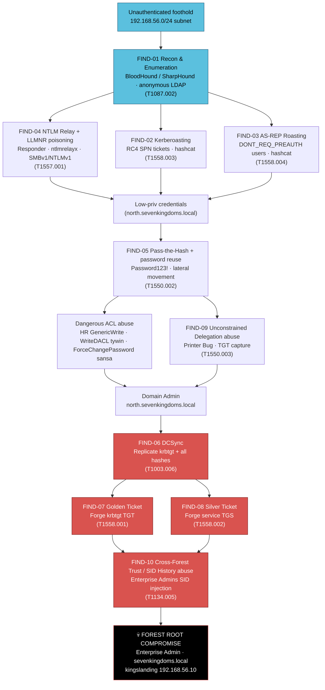
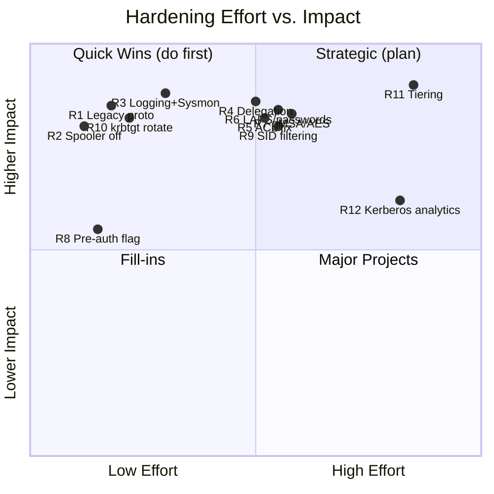

<!--
================================================================================
  PENETRATION TEST REPORT
================================================================================
-->

# Internal Active Directory Penetration Test — "Seven Kingdoms" Two-Forest Lab

| | |
|---|---|
| **Engagement Name** | Internal Active Directory Security Assessment — Seven Kingdoms Lab |
| **Classification** | Lab / Portfolio (Non-production, simulated environment) |
| **Assessment Date** | 2026-05-17 |
| **Report Date** | 2026-05-17 |
| **Author** | `<Author Name / Handle>` — Offensive Security Engineer |
| **Reviewer** | `<Reviewer Name>` |
| **Document Version** | 1.0 |
| **Distribution** | Portfolio / Public demonstration |

> **Disclaimer.** This report documents activity performed against a purpose-built, isolated laboratory environment (`192.168.56.0/24`) constructed solely for security research, skills demonstration, and portfolio purposes. No production systems, real users, or third-party data were involved. All credentials, hostnames, and data are fictitious.

---

## Table of Contents

1. [Executive Summary](#1-executive-summary)
2. [Methodology](#2-methodology)
3. [Findings](#3-findings)
4. [Detection Gap Analysis](#4-detection-gap-analysis)
5. [Hardening Roadmap](#5-hardening-roadmap)
6. [Appendix](#6-appendix)

---

## 1. Executive Summary

This engagement was a simulated **internal Active Directory (AD) assessment** of a two-forest lab modelling a typical small-to-medium enterprise that operates a parent domain (`sevenkingdoms.local`) and a child domain (`north.sevenkingdoms.local`) joined by a parent-child trust. The objective was to evaluate how far an attacker who has gained an initial foothold on the internal network — for example via a phished workstation, a rogue device, or a malicious insider — could escalate, and whether existing logging would detect the activity.

**Bottom line:** Starting from an **unauthenticated position on the internal subnet**, the assessment achieved **full forest compromise (Enterprise Admin / domain dominance across both domains)**. The path required no software exploits or zero-days — it relied entirely on misconfigurations, weak credentials, legacy protocols, and dangerous permission assignments that are common in real environments. An adversary who reaches the internal LAN should be assumed capable of reproducing this result.

The compromise chained together a small number of well-understood weaknesses: legacy authentication protocols (SMBv1, NTLMv1, LLMNR) that enabled credential interception; service accounts protected by weak, crackable passwords (Kerberoasting / AS-REP Roasting); pervasive password reuse (`Password123!`); over-privileged Access Control Lists (ACLs); unconstrained Kerberos delegation; and a trust relationship that allowed privilege to flow from the child domain up into the forest root. Once domain-level credentials were obtained, the tester forged Kerberos tickets (Golden and Silver Tickets) and replicated the domain credential store (DCSync), establishing durable, hard-to-detect control.

### 1.1 Overall Risk Rating

> ## 🔴 OVERALL RISK: **CRITICAL**

The combination of trivial initial access, multiple independent privilege-escalation paths, and near-total absence of detection for the most damaging techniques means the environment offers an attacker a fast, reliable, and stealthy route to total control. In a production equivalent this would represent an immediate and severe business risk.

### 1.2 Findings by Severity

| Severity | Count | Findings |
|---|---|---|
| 🔴 **Critical** | 4 | FIND-06 DCSync, FIND-07 Golden Ticket, FIND-09 Unconstrained Delegation, FIND-10 Cross-Forest / SID History |
| 🟠 **High** | 5 | FIND-02 Kerberoasting, FIND-03 AS-REP Roasting, FIND-04 NTLM Relay, FIND-05 Pass-the-Hash, FIND-08 Silver Ticket |
| 🟡 **Medium** | 1 | FIND-01 BloodHound Enumeration |
| 🔵 **Low** | 0 | — |
| ℹ️ **Informational** | 0 | — |
| **Total** | **10** | |

### 1.3 Top 3 Recommendations

1. **Eliminate legacy authentication and enforce Kerberos hygiene.** Disable SMBv1, NTLMv1, and LLMNR/NBT-NS network-wide; require SMB signing; move service accounts to **Group Managed Service Accounts (gMSA)** with AES-only encryption and disable RC4. This single program of work neutralises the credential-interception and roasting findings (FIND-02, FIND-03, FIND-04).

2. **Repair the privilege model: ACLs, delegation, and tiering.** Remediate the dangerous ACLs (HR `GenericWrite` over Finance, ServiceAccounts `WriteDACL`, Authenticated Users `ForceChangePassword`), remove **unconstrained delegation** from all accounts (replacing it with constrained / resource-based delegation where required), and implement a **tiered administration model** so that Tier 0 (domain/forest control plane) credentials never touch lower-trust hosts (FIND-05, FIND-09).

3. **Harden the forest boundary and close the detection gap.** Enable **SID Filtering / selective authentication** on the trust to stop privilege flowing from child to root, rotate the `krbtgt` account (twice) to invalidate forged Golden Tickets, and deploy **uniform logging** — Sysmon on every host, Kerberos/RC4 event auditing, LDAP query logging, and Directory Service replication (Event ID 4662) auditing — feeding a SIEM with the supplied detection content (FIND-06, FIND-07, FIND-08, FIND-10).

---

## 2. Methodology

### 2.1 Frameworks & Standards

This assessment was conducted and is reported in alignment with the following industry standards and frameworks:

| Framework | Role in this engagement |
|---|---|
| **NIST SP 800-115** (Technical Guide to Information Security Testing and Assessment) | Overall test process: Planning → Discovery → Attack → Reporting. |
| **MITRE ATT&CK** (Enterprise) | Classification of every offensive action by Tactic and Technique ID (e.g. `T1558.003`). |
| **CIS Controls v8** | Mapping of remediations to defensive controls (e.g. CIS 4 Secure Configuration, CIS 5 Account Management, CIS 6 Access Control, CIS 8 Audit Log Management). |
| **CVSS 3.1** | Severity scoring of each finding using vector strings and base scores. |

### 2.2 Engagement Phases

The assessment followed a structured, phased kill-chain that mirrors a realistic intrusion:

1. **Reconnaissance** — Passive and active discovery of the `192.168.56.0/24` subnet; host enumeration of the five lab systems and identification of domain controllers and services.
2. **Enumeration** — Authenticated and anonymous AD enumeration: collecting users, groups, SPNs, ACLs, trusts, and delegation settings (BloodHound / SharpHound; anonymous LDAP).
3. **Credential Access** — Harvesting and cracking credentials: Kerberoasting, AS-REP Roasting, NTLM relay/poisoning, and dumping hashes.
4. **Lateral Movement** — Reusing harvested credentials and hashes (Pass-the-Hash, password reuse) to pivot between member servers and workstations.
5. **Privilege Escalation** — Abusing dangerous ACLs and delegation to climb from low-privileged user to Domain Admin within `north.sevenkingdoms.local`.
6. **Domain & Forest Dominance** — DCSync, Golden/Silver Ticket forgery, and cross-forest trust / SID History abuse to seize Enterprise Admin in the forest root `sevenkingdoms.local`.

### 2.3 Scope

| Asset | Hostname | Role | IP |
|---|---|---|---|
| Forest Root DC | `kingslanding` | DC — `sevenkingdoms.local` | `192.168.56.10` |
| Member Server | `castelblack` | Member — `sevenkingdoms.local` | `192.168.56.11` |
| Child DC | `winterfell` | DC — `north.sevenkingdoms.local` | `192.168.56.12` |
| Member Server | `meereen` | Member — `north.sevenkingdoms.local` | `192.168.56.13` |
| Workstation | `braavos` | Win10 workstation | `192.168.56.14` |
| Network | — | Subnet | `192.168.56.0/24` |

### 2.4 Attack Path / Kill Chain



---

## 3. Findings

Each finding below is scored with a **CVSS 3.1 base vector**. Where a technique is primarily a *post-exploitation / persistence* action (Golden/Silver Ticket, DCSync), the score reflects the impact assuming the prerequisite access has been obtained, and this is called out explicitly. Severity bands: Critical (9.0–10.0), High (7.0–8.9), Medium (4.0–6.9), Low (0.1–3.9).

---

### FIND-01 — Active Directory Enumeration via BloodHound

| | |
|---|---|
| **Finding ID** | FIND-01 |
| **MITRE ATT&CK** | [T1087.002 — Account Discovery: Domain Account](https://attack.mitre.org/techniques/T1087/002/) |
| **CVSS 3.1 Vector** | `CVSS:3.1/AV:N/AC:L/PR:L/UI:N/S:U/C:H/I:N/A:N` |
| **Base Score** | **5.7** |
| **Severity** | 🟡 **Medium** |
| **Affected Assets** | Entire forest (`kingslanding`, `winterfell`); anonymous LDAP exposure on DCs |

**Description.** Using a single low-privileged domain account (and, in places, anonymous LDAP binds permitted by the DCs), SharpHound collected the full graph of users, groups, sessions, ACLs, trusts, SPNs, and delegation settings. Ingested into BloodHound CE, this exposed every subsequent attack path — Kerberoastable accounts, AS-REP roastable users, dangerous ACLs (HR→Finance `GenericWrite`, `WriteDACL` on ServiceAccounts, `ForceChangePassword` on `sansa`), unconstrained delegation hosts, and the shortest path to Domain/Enterprise Admin.

**Evidence.** [`../attacks/01-bloodhound-enumeration.md`](../attacks/01-bloodhound-enumeration.md) · `../screenshots/01-bloodhound-shortest-path.png`, `../screenshots/01-sharphound-collection.png`

**Business Impact.** Enumeration itself does not alter data, but it is the force-multiplier that converts a foothold into a guaranteed compromise. Anonymous LDAP makes this possible even pre-authentication, removing a key barrier and providing the attacker a complete map of the attack surface.

**Remediation Summary.** Restrict anonymous/Authenticated-Users read of sensitive attributes; monitor for high-volume LDAP queries and SharpHound signatures; deploy LDAP query logging. See [`../hardening/hardening.md`](../hardening/hardening.md).

---

### FIND-02 — Kerberoasting of RC4 Service Accounts

| | |
|---|---|
| **Finding ID** | FIND-02 |
| **MITRE ATT&CK** | [T1558.003 — Steal or Forge Kerberos Tickets: Kerberoasting](https://attack.mitre.org/techniques/T1558/003/) |
| **CVSS 3.1 Vector** | `CVSS:3.1/AV:N/AC:L/PR:L/UI:N/S:C/C:H/I:H/A:N` |
| **Base Score** | **8.5** |
| **Severity** | 🟠 **High** |
| **Affected Assets** | Service accounts with SPNs across both domains; DCs issuing RC4 TGS |

**Description.** Any authenticated user can request a Kerberos service ticket (TGS) for any account with a registered SPN. The DCs issued tickets encrypted with **RC4-HMAC** (etype 23), whose key is the account's NTLM hash. Tickets for the lab's service accounts were requested with Impacket `GetUserSPNs.py` / Rubeus and cracked offline in hashcat (mode 13100). Because the service-account passwords were weak, plaintext credentials were recovered, granting service-level (and via reuse, broader) access. Scope is *Changed* because cracking yields credentials usable beyond the originally authenticated context.

**Evidence.** [`../attacks/02-kerberoasting.md`](../attacks/02-kerberoasting.md) · `../screenshots/02-getuserspns.png`, `../screenshots/02-hashcat-cracked.png`

**Business Impact.** Compromise of service accounts — often privileged and used across many systems — provides durable, legitimate-looking access and a stepping stone toward domain dominance.

**Remediation Summary.** Migrate to gMSA with 25+ character managed passwords; enforce AES-only and disable RC4; set strong passphrases on remaining SPN accounts; monitor for 4769 RC4 ticket requests. See [`../hardening/hardening.md`](../hardening/hardening.md).

---

### FIND-03 — AS-REP Roasting of Pre-Auth-Disabled Accounts

| | |
|---|---|
| **Finding ID** | FIND-03 |
| **MITRE ATT&CK** | [T1558.004 — Steal or Forge Kerberos Tickets: AS-REP Roasting](https://attack.mitre.org/techniques/T1558/004/) |
| **CVSS 3.1 Vector** | `CVSS:3.1/AV:N/AC:L/PR:N/UI:N/S:U/C:H/I:N/A:N` |
| **Base Score** | **7.5** |
| **Severity** | 🟠 **High** |
| **Affected Assets** | User accounts with `DONT_REQUIRE_PREAUTH` set in both domains |

**Description.** Accounts configured with "Do not require Kerberos pre-authentication" allow *any unauthenticated* requester to obtain an AS-REP message whose encrypted portion is derived from the user's password. Impacket `GetNPUsers.py` harvested AS-REP hashes for the affected users; these were cracked offline in hashcat (mode 18200), recovering plaintext passwords. `PR:N` reflects that no credentials are required to request the AS-REP.

**Evidence.** [`../attacks/03-asrep-roasting.md`](../attacks/03-asrep-roasting.md) · `../screenshots/03-getnpusers.png`, `../screenshots/03-asrep-cracked.png`

**Business Impact.** Provides an *unauthenticated* path to valid domain credentials, lowering the bar for initial access and feeding the lateral-movement and escalation chain.

**Remediation Summary.** Remove `DONT_REQUIRE_PREAUTH` from all accounts; enforce strong passwords; alert on AS-REQ without pre-auth (4768 with pre-auth type 0). See [`../hardening/hardening.md`](../hardening/hardening.md).

---

### FIND-04 — NTLM Relay & LLMNR/NBT-NS Poisoning

| | |
|---|---|
| **Finding ID** | FIND-04 |
| **MITRE ATT&CK** | [T1557.001 — Adversary-in-the-Middle: LLMNR/NBT-NS Poisoning and SMB Relay](https://attack.mitre.org/techniques/T1557/001/) |
| **CVSS 3.1 Vector** | `CVSS:3.1/AV:A/AC:H/PR:N/UI:R/S:C/C:H/I:H/A:N` |
| **Base Score** | **7.3** |
| **Severity** | 🟠 **High** |
| **Affected Assets** | `braavos`, `meereen`, `castelblack` (SMB signing not enforced); LLMNR/NBT-NS enabled subnet-wide |

**Description.** With LLMNR and NBT-NS enabled and SMB signing not enforced, Responder answered broadcast name-resolution requests to coerce victim authentication, and Impacket `ntlmrelayx.py` relayed the captured NTLM authentication to other hosts where signing was absent. Captured NetNTLM hashes were also cracked offline. The presence of SMBv1 and NTLMv1 further weakened the captured material. This yielded authenticated sessions and credentials without ever knowing a password. `AV:A` (adjacent network) and `UI:R` (a victim must trigger name resolution) temper the otherwise high impact.

**Evidence.** [`../attacks/04-ntlm-relay.md`](../attacks/04-ntlm-relay.md) · `../screenshots/04-responder-capture.png`, `../screenshots/04-ntlmrelayx.png`

**Business Impact.** Allows credential theft and lateral movement from a passive position on the LAN, frequently the first pivot after a phished workstation.

**Remediation Summary.** Disable LLMNR/NBT-NS via GPO; enforce SMB signing on all hosts; disable SMBv1 and NTLMv1; restrict NTLM and prefer Kerberos. See [`../hardening/hardening.md`](../hardening/hardening.md).

---

### FIND-05 — Pass-the-Hash & Credential Reuse

| | |
|---|---|
| **Finding ID** | FIND-05 |
| **MITRE ATT&CK** | [T1550.002 — Use Alternate Authentication Material: Pass the Hash](https://attack.mitre.org/techniques/T1550/002/) |
| **CVSS 3.1 Vector** | `CVSS:3.1/AV:N/AC:L/PR:L/UI:N/S:C/C:H/I:H/A:H` |
| **Base Score** | **9.6** |
| **Severity** | 🟠 **High** |
| **Affected Assets** | `castelblack`, `meereen`, `braavos`; accounts sharing `Password123!` |

**Description.** NTLM password hashes recovered from earlier phases (and via local SAM/LSASS access) were replayed directly using netexec/crackmapexec and Impacket (`psexec.py`, `wmiexec.py`, `-hashes`) to authenticate to additional hosts without cracking. Widespread reuse of `Password123!` across local-admin and service accounts meant a single recovered secret unlocked multiple systems, enabling rapid lateral movement and local administrative control. Although the CVSS base computes to 9.6, this finding is rated **High** rather than Critical because exploitation depends on credentials/hashes already obtained from prior findings — it is a movement primitive rather than the source of compromise.

**Evidence.** [`../attacks/05-pass-the-hash.md`](../attacks/05-pass-the-hash.md) · `../screenshots/05-cme-pth.png`, `../screenshots/05-wmiexec.png`

**Business Impact.** Password reuse and PtH allow an attacker to traverse the estate quickly and blend in with legitimate administrative traffic, accelerating the path to a DC.

**Remediation Summary.** Enforce unique local-admin passwords with **LAPS**; enable Credential Guard; restrict lateral SMB/WMI; apply tiered admin and "Protected Users" group. See [`../hardening/hardening.md`](../hardening/hardening.md).

---

### FIND-06 — DCSync (Domain Replication Abuse)

| | |
|---|---|
| **Finding ID** | FIND-06 |
| **MITRE ATT&CK** | [T1003.006 — OS Credential Dumping: DCSync](https://attack.mitre.org/techniques/T1003/006/) |
| **CVSS 3.1 Vector** | `CVSS:3.1/AV:N/AC:L/PR:H/UI:N/S:C/C:H/I:H/A:H` |
| **Base Score** | **9.1** |
| **Severity** | 🔴 **Critical** |
| **Affected Assets** | `winterfell` and `kingslanding` (Directory Service); `krbtgt` and all domain principals |

**Description.** With an account holding the `DS-Replication-Get-Changes` / `...-All` rights (reached via the ACL and delegation escalation paths), the tester used Impacket `secretsdump.py` and Mimikatz `lsadump::dcsync` to impersonate a DC and replicate the credential store — including the `krbtgt` hash and every user's NTLM hash. `PR:H` reflects the required high-privilege rights, but the impact is total credential disclosure for the domain.

**Evidence.** `../attacks/06-dcsync.md` · `../screenshots/06-secretsdump-krbtgt.png`, `../screenshots/06-mimikatz-dcsync.png`

**Business Impact.** Disclosure of `krbtgt` enables Golden Tickets and indefinite, stealthy persistence; disclosure of all hashes enables impersonation of any user, including Domain and Enterprise Admins.

**Remediation Summary.** Restrict and audit replication rights; alert on Event ID 4662 with the replication GUIDs; rotate `krbtgt` twice; apply tiered admin. See [`../hardening/hardening.md`](../hardening/hardening.md).

---

### FIND-07 — Golden Ticket Forgery

| | |
|---|---|
| **Finding ID** | FIND-07 |
| **MITRE ATT&CK** | [T1558.001 — Steal or Forge Kerberos Tickets: Golden Ticket](https://attack.mitre.org/techniques/T1558/001/) |
| **CVSS 3.1 Vector** | `CVSS:3.1/AV:N/AC:L/PR:H/UI:N/S:C/C:H/I:H/A:H` |
| **Base Score** | **9.1** |
| **Severity** | 🔴 **Critical** |
| **Affected Assets** | Entire `north.sevenkingdoms.local` (and forest via trust); `krbtgt` |

**Description.** Using the `krbtgt` hash obtained in FIND-06, the tester forged a Ticket-Granting Ticket (TGT) with arbitrary group membership (including Domain Admins and, via SID History, Enterprise Admins) using Mimikatz `kerberos::golden` and Rubeus. The forged TGT grants access to any service as any user for an attacker-chosen lifetime, independent of the real account's password.

> **Post-exploitation note.** This is a **persistence / forgery** technique that requires prior compromise of `krbtgt` (FIND-06). The CVSS base score (9.1, `PR:H`) reflects that prerequisite. The *unrestricted* impact — total, durable domain control surviving password resets — is why it is rated **Critical**. Were it scored purely on impact assuming `krbtgt` is already held, it approaches the often-cited 9.8; we retain `PR:H` for internal consistency with FIND-06.

**Evidence.** `../attacks/07-golden-ticket.md` · `../screenshots/07-mimikatz-golden.png`, `../screenshots/07-ptt-dcaccess.png`

**Business Impact.** Provides effectively permanent domain control. Remediation requires a double `krbtgt` rotation; otherwise the attacker retains access indefinitely.

**Remediation Summary.** Rotate `krbtgt` twice; reduce maximum ticket lifetime; deploy forged-ticket detection (anomalous TGT lifetime, mismatched encryption); protect Tier 0. See [`../hardening/hardening.md`](../hardening/hardening.md).

---

### FIND-08 — Silver Ticket Forgery

| | |
|---|---|
| **Finding ID** | FIND-08 |
| **MITRE ATT&CK** | [T1558.002 — Steal or Forge Kerberos Tickets: Silver Ticket](https://attack.mitre.org/techniques/T1558/002/) |
| **CVSS 3.1 Vector** | `CVSS:3.1/AV:N/AC:L/PR:L/UI:N/S:U/C:H/I:H/A:N` |
| **Base Score** | **8.1** |
| **Severity** | 🟠 **High** |
| **Affected Assets** | Individual services (SMB/CIFS, HOST, MSSQL) on `meereen`, `castelblack` |

**Description.** Using a service account's NTLM hash (from Kerberoasting/DCSync), the tester forged a service ticket (TGS) for a specific SPN with Mimikatz `kerberos::silver`. Because a Silver Ticket is presented directly to the target service and is *never validated by the DC* (PAC validation is frequently not enforced), it is stealthier than a Golden Ticket but scoped to one service per ticket — hence High rather than Critical, with `S:U`.

**Evidence.** `../attacks/08-silver-ticket.md` · `../screenshots/08-mimikatz-silver.png`, `../screenshots/08-silver-smb.png`

**Business Impact.** Grants persistent, low-noise access to targeted services (file shares, databases) without contacting a DC, evading many ticket-based detections.

**Remediation Summary.** Rotate service-account secrets / move to gMSA; enable PAC validation; reduce service-account privileges; monitor service logons lacking a corresponding 4769. See [`../hardening/hardening.md`](../hardening/hardening.md).

---

### FIND-09 — Unconstrained Delegation Abuse

| | |
|---|---|
| **Finding ID** | FIND-09 |
| **MITRE ATT&CK** | [T1550.003 — Use Alternate Authentication Material: Pass the Ticket](https://attack.mitre.org/techniques/T1550/003/) |
| **CVSS 3.1 Vector** | `CVSS:3.1/AV:N/AC:H/PR:L/UI:N/S:C/C:H/I:H/A:H` |
| **Base Score** | **9.0** |
| **Severity** | 🔴 **Critical** |
| **Affected Assets** | Host(s) configured for unconstrained delegation; `winterfell` / `kingslanding` DC computer accounts |

**Description.** A host trusted for **unconstrained delegation** caches the TGT of every account that authenticates to it. The tester coerced a Domain Controller to authenticate to the delegation host using the **Print Spooler "Printer Bug"** (`MS-RPRN` / SpoolSample) and the PetitPotam-class coercion, then extracted the DC's TGT from memory with Rubeus (`monitor` / `triage`) and replayed it (Pass-the-Ticket). Capturing a DC's TGT is equivalent to compromising the domain. `AC:H` reflects the coercion/timing dependency.

**Evidence.** `../attacks/09-unconstrained-delegation.md` · `../screenshots/09-spoolsample.png`, `../screenshots/09-rubeus-monitor-dc-tgt.png`

**Business Impact.** A single mis-set delegation flag plus an enabled print spooler turns any compromised member into a direct route to full domain compromise, bypassing the need to crack any DA credential.

**Remediation Summary.** Remove unconstrained delegation everywhere; use constrained / RBCD; disable Print Spooler on DCs; add Tier 0 accounts to "Protected Users" and mark them sensitive/not-delegable. See [`../hardening/hardening.md`](../hardening/hardening.md).

---

### FIND-10 — Cross-Forest Trust Abuse via SID History

| | |
|---|---|
| **Finding ID** | FIND-10 |
| **MITRE ATT&CK** | [T1134.005 — Access Token Manipulation: SID-History Injection](https://attack.mitre.org/techniques/T1134/005/) |
| **CVSS 3.1 Vector** | `CVSS:3.1/AV:N/AC:L/PR:H/UI:N/S:C/C:H/I:H/A:H` |
| **Base Score** | **9.1** |
| **Severity** | 🔴 **Critical** |
| **Affected Assets** | Forest root `sevenkingdoms.local` / `kingslanding`; parent-child trust |

**Description.** Having achieved Domain Admin in the child domain (`north.sevenkingdoms.local`), the tester injected the **Enterprise Admins** group SID (`<root-domain-SID>-519`) into the SID History of a forged ticket. Because **SID Filtering was not enabled** on the intra-forest parent-child trust, the forest root honoured the injected SID, elevating the child-domain identity to Enterprise Admin and granting control of the forest root DC. This was achieved by combining the DCSync'd child `krbtgt` (FIND-06) with a Golden Ticket carrying the extra SID (`mimikatz kerberos::golden /sids:`).

**Evidence.** `../attacks/10-cross-forest-sidhistory.md` · `../screenshots/10-golden-sidhistory.png`, `../screenshots/10-enterprise-admin-kingslanding.png`

**Business Impact.** Demonstrates that the trust boundary provided no security boundary: compromise of the lower-trust child domain led directly to total ownership of the forest root and every domain within it.

**Remediation Summary.** Enable SID Filtering / quarantine on trusts where appropriate; treat the forest (not the domain) as the security boundary; rotate `krbtgt` in *both* domains; implement a forest-wide Tier 0 model. See [`../hardening/hardening.md`](../hardening/hardening.md).

---

## 4. Detection Gap Analysis

The table below maps each attack to whether it was **detectable with the logging present during the engagement**, the relevant data source, and the residual gap. Detection content (queries) is maintained in [`../detection/kql-queries.md`](../detection/kql-queries.md), with platform variants in [`../detection/splunk-queries.md`](../detection/splunk-queries.md) and [`../detection/elastic-queries.md`](../detection/elastic-queries.md), and behavioural rules under [`../detection/sigma-rules/`](../detection/sigma-rules/).

| Finding | Attack | Detectable? | Primary Data Source | Detection Gap |
|---|---|---|---|---|
| FIND-01 | BloodHound Enumeration | ⚠️ Partial | Security 4661/4662; LDAP queries; net traffic | **LDAP query logging not enabled**; anonymous LDAP unaudited; high-volume reads not alerted. |
| FIND-02 | Kerberoasting | ⚠️ Partial | Security 4769 (TGS request) | RC4 (etype 0x17) ticket requests **not specifically alerted**; offline cracking invisible. |
| FIND-03 | AS-REP Roasting | ⚠️ Partial | Security 4768 (AS-REQ) | Pre-auth-type=0 / etype RC4 4768 events **not flagged**; no baseline of normal AS-REQ. |
| FIND-04 | NTLM Relay / LLMNR | ⚠️ Partial | Sysmon 22 (DNS), 3 (net); Security 4624 NTLM | LLMNR/NBT-NS broadcasts unmonitored; **NTLMv1 usage and relayed logons not correlated**; Sysmon absent on some hosts. |
| FIND-05 | Pass-the-Hash | ⚠️ Partial | Security 4624 (LogonType 3/9), 4672 | No correlation of NTLM-only logons from non-interactive sources; **inconsistent Sysmon coverage** masks process lineage. |
| FIND-06 | DCSync | ❌ Not detected | Security **4662** (replication GUID) | **Directory Service replication auditing (4662) not enabled** on DCs — the single most important DCSync signal was missing. |
| FIND-07 | Golden Ticket | ❌ Not detected | Security 4768/4769; ticket anomalies | No baseline for TGT lifetime/encryption; forged TGTs **never touch the AS exchange**, so no 4768 — undetectable without behavioural analytics. |
| FIND-08 | Silver Ticket | ❌ Not detected | Service host 4624/4634; 4769 absence | Forged TGS **bypasses the DC entirely** — no 4769; service-side PAC validation off; member-host logging sparse. |
| FIND-09 | Unconstrained Delegation / Printer Bug | ⚠️ Partial | Security 4624; Sysmon 1; Spooler/RPC logs | Print Spooler / `MS-RPRN` RPC calls unlogged; **coercion + TGT capture not detected**; no alert on DC authenticating to a member. |
| FIND-10 | Cross-Forest / SID History | ❌ Not detected | Security 4768/4769 across trust; 4765/4766 | No cross-domain ticket correlation; **SID History additions (4765/4766) not audited**; forged ticket with extra SIDs invisible. |

### 4.1 Missing Telemetry — Summary

- **No Sysmon on some hosts** (member servers / workstation) — process, network, and image-load visibility is inconsistent, breaking lateral-movement and coercion detection. Standardise on Sysmon v15.x using [`../detection/sysmon-config.xml`](../detection/sysmon-config.xml).
- **RC4 / encryption-downgrade events not surfaced** — 4768/4769 events are collected but not filtered for RC4 (etype 0x17) or pre-auth-type 0, hiding Kerberoasting/AS-REP Roasting.
- **LDAP query logging disabled** — BloodHound-style mass enumeration and anonymous binds go unrecorded.
- **Directory Service replication auditing (Event ID 4662) not enabled** — the canonical DCSync detection is absent, leaving the most damaging credential-theft technique invisible.
- **No behavioural Kerberos analytics** — Golden/Silver Tickets produce little or no DC-side logging, so signature-based alerting cannot see them; anomaly detection (ticket lifetime, encryption type, SID anomalies) is required.

---

## 5. Hardening Roadmap

Remediations are prioritised by an **effort vs. impact** assessment. "Effort" considers operational complexity and change risk; "Impact" considers how many findings and how much attacker capability the control removes. Full step-by-step guidance is in [`../hardening/hardening.md`](../hardening/hardening.md).

### 5.1 Effort / Impact Matrix

| # | Remediation | Effort | Impact | Priority | Addresses Findings |
|---|---|---|---|---|---|
| R1 | Disable LLMNR/NBT-NS; enforce SMB signing; disable SMBv1/NTLMv1 | Low | High | **P1** | FIND-04, FIND-05 |
| R2 | Disable Print Spooler on DCs | Low | High | **P1** | FIND-09 |
| R3 | Enable 4662 replication auditing, RC4/pre-auth event filtering, LDAP logging; deploy Sysmon everywhere | Low–Med | High | **P1** | FIND-01, FIND-02, FIND-03, FIND-06 |
| R4 | Remove unconstrained delegation; use constrained/RBCD | Medium | High | **P1** | FIND-09 |
| R5 | Remediate dangerous ACLs (GenericWrite/WriteDACL/ForceChangePassword) | Medium | High | **P1** | FIND-01, FIND-05 |
| R6 | Eliminate password reuse; deploy LAPS; strong password/lockout policy (esp. Finance) | Medium | High | **P2** | FIND-05, FIND-02, FIND-03 |
| R7 | Migrate service accounts to gMSA; enforce AES-only / disable RC4 | Medium | High | **P2** | FIND-02, FIND-08 |
| R8 | Remove `DONT_REQUIRE_PREAUTH` flags | Low | Medium | **P2** | FIND-03 |
| R9 | Enable SID Filtering on trust; treat forest as security boundary | Medium | High | **P2** | FIND-10 |
| R10 | Rotate `krbtgt` twice (both domains); reduce ticket lifetimes | Low | High | **P2** | FIND-06, FIND-07, FIND-10 |
| R11 | Implement tiered administration; "Protected Users"; Credential Guard | High | High | **P3** | FIND-05, FIND-06, FIND-07, FIND-09 |
| R12 | Deploy behavioural Kerberos detection analytics | High | Medium | **P3** | FIND-07, FIND-08 |

### 5.2 Prioritisation Diagram



### 5.3 Phased 30 / 60 / 90-Day Plan

```mermaid
flowchart LR
    subgraph P1["0–30 Days · Stop the Bleeding (P1)"]
        A1["R1 Disable LLMNR/NTLMv1/SMBv1 + SMB signing"]
        A2["R2 Disable Print Spooler on DCs"]
        A3["R3 Enable 4662 / RC4 / LDAP logging + Sysmon"]
        A4["R4 Remove unconstrained delegation"]
        A5["R5 Fix dangerous ACLs"]
    end
    subgraph P2["31–60 Days · Reduce Attack Surface (P2)"]
        B1["R6 LAPS + password policy"]
        B2["R7 gMSA + AES-only"]
        B3["R8 Remove pre-auth flags"]
        B4["R9 Enable SID filtering"]
        B5["R10 Rotate krbtgt x2"]
    end
    subgraph P3["61–90 Days · Strategic Hardening (P3)"]
        C1["R11 Tiered admin + Protected Users + Credential Guard"]
        C2["R12 Behavioural Kerberos analytics"]
    end
    P1 --> P2 --> P3
```



**30 days (P1 — Stop the bleeding):** R1–R5. Low-effort, high-impact changes that immediately break the credential-interception, coercion, and detection-blindness that enabled the chain.

**60 days (P2 — Reduce attack surface):** R6–R10. Eliminate password reuse, modernise service accounts, close the pre-auth and trust gaps, and invalidate any forged tickets via `krbtgt` rotation.

**90 days (P3 — Strategic hardening):** R11–R12. Establish a durable tiered-administration model and behavioural detection so future attempts are both harder and visible.

---

## 6. Appendix

### 6.1 Tool Versions

| Tool | Version | Purpose |
|---|---|---|
| Impacket | v0.12.0 | `GetUserSPNs.py`, `GetNPUsers.py`, `ntlmrelayx.py`, `secretsdump.py`, `psexec.py`, `wmiexec.py` |
| Rubeus | v2.3.2 | Kerberoasting, AS-REP roasting, ticket monitoring, PtT, Golden/Silver tickets |
| BloodHound CE | 6.x | AD attack-path graph analysis |
| SharpHound | (bundled w/ BloodHound CE 6.x) | AD data collection |
| Mimikatz | 2.2.0 | DCSync, Golden/Silver ticket forgery, credential extraction |
| hashcat | v6.2.6 | Offline cracking (modes 13100 Kerberoast, 18200 AS-REP, NetNTLM) |
| Responder | (current) | LLMNR/NBT-NS poisoning, credential capture |
| netexec / crackmapexec | (current) | Pass-the-Hash, lateral movement, enumeration |
| Sysmon | v15.x | Host telemetry (with [`../detection/sysmon-config.xml`](../detection/sysmon-config.xml)) |

### 6.2 Command Reference (Key Commands per Attack)

```bash
# FIND-01 — BloodHound enumeration
SharpHound.exe -c All -d north.sevenkingdoms.local
# (or) python bloodhound.py -c All -u user -p 'pass' -d north.sevenkingdoms.local -ns 192.168.56.12

# FIND-02 — Kerberoasting
GetUserSPNs.py north.sevenkingdoms.local/user:'pass' -dc-ip 192.168.56.12 -request
hashcat -m 13100 kerberoast.hash rockyou.txt

# FIND-03 — AS-REP Roasting
GetNPUsers.py north.sevenkingdoms.local/ -usersfile users.txt -dc-ip 192.168.56.12 -no-pass
hashcat -m 18200 asrep.hash rockyou.txt

# FIND-04 — NTLM Relay / LLMNR poisoning
responder -I eth0 -wd
ntlmrelayx.py -tf targets.txt -smb2support -socks

# FIND-05 — Pass-the-Hash
netexec smb 192.168.56.0/24 -u Administrator -H <NTLM_HASH> --local-auth
wmiexec.py -hashes :<NTLM_HASH> administrator@192.168.56.13

# FIND-06 — DCSync
secretsdump.py north.sevenkingdoms.local/dauser:'pass'@192.168.56.12 -just-dc
mimikatz # lsadump::dcsync /domain:north.sevenkingdoms.local /user:krbtgt

# FIND-07 — Golden Ticket
mimikatz # kerberos::golden /user:Administrator /domain:north.sevenkingdoms.local \
          /sid:<DOMAIN_SID> /krbtgt:<KRBTGT_HASH> /ptt

# FIND-08 — Silver Ticket
mimikatz # kerberos::golden /user:Administrator /domain:north.sevenkingdoms.local \
          /sid:<DOMAIN_SID> /target:meereen.north.sevenkingdoms.local \
          /service:cifs /rc4:<SVC_NTLM_HASH> /ptt

# FIND-09 — Unconstrained Delegation (Printer Bug + TGT capture)
Rubeus.exe monitor /interval:5 /nowrap
SpoolSample.exe winterfell.north.sevenkingdoms.local <DELEGATION_HOST>
Rubeus.exe ptt /ticket:<captured_dc.kirbi>

# FIND-10 — Cross-Forest Trust / SID History
mimikatz # kerberos::golden /user:Administrator /domain:north.sevenkingdoms.local \
          /sid:<CHILD_DOMAIN_SID> /krbtgt:<CHILD_KRBTGT_HASH> \
          /sids:<ROOT_DOMAIN_SID>-519 /ptt   # -519 = Enterprise Admins
```

### 6.3 Glossary

| Term | Definition |
|---|---|
| **TGT** (Ticket-Granting Ticket) | The master Kerberos ticket issued by the KDC after initial authentication, used to request service tickets without re-entering a password. |
| **TGS** (Ticket-Granting Service ticket) | A Kerberos ticket for a *specific* service/SPN, presented to that service to gain access. |
| **SPN** (Service Principal Name) | A unique identifier tying a service instance to a service account; the basis for Kerberos ticket requests and Kerberoasting. |
| **NTLM** | A challenge-response authentication protocol; its password-derived hash can be replayed (Pass-the-Hash) or relayed. |
| **NTLMv1** | Legacy, cryptographically weak variant of NTLM; trivially crackable and should be disabled. |
| **Kerberoasting** | Requesting TGS tickets for SPN accounts and cracking the RC4-encrypted ticket offline to recover the service password. |
| **AS-REP Roasting** | Requesting an AS-REP for an account with pre-authentication disabled and cracking the encrypted blob offline. |
| **DCSync** | Abusing directory-replication rights to make a DC hand over credential data (including `krbtgt` and all NTLM hashes). |
| **Golden Ticket** | A forged TGT signed with the stolen `krbtgt` key, granting arbitrary identity/privileges for an attacker-chosen lifetime. |
| **Silver Ticket** | A forged TGS for a single service, signed with that service account's key; never validated by a DC, hence stealthy. |
| **SID History** | An attribute holding prior SIDs (used in migrations); injecting a privileged SID grants those privileges across a trust if SID Filtering is off. |
| **Unconstrained Delegation** | A setting that lets a host cache the TGT of any account authenticating to it, enabling impersonation if that host is compromised. |
| **Constrained Delegation / RBCD** | Safer delegation models limiting impersonation to specific services (constrained) or controlled by the target resource (Resource-Based Constrained Delegation). |
| **Pass-the-Hash (PtH)** | Authenticating with an NTLM hash directly, without knowing or cracking the plaintext password. |
| **Pass-the-Ticket (PtT)** | Injecting a stolen or forged Kerberos ticket into a session to authenticate as the ticket's principal. |
| **LLMNR / NBT-NS** | Legacy name-resolution protocols that can be poisoned to coerce victim authentication for capture/relay. |
| **SMB Signing** | Integrity protection for SMB that, when enforced, prevents NTLM relay attacks. |
| **krbtgt** | The hidden account whose key signs all Kerberos tickets in a domain; its compromise enables Golden Tickets. |
| **gMSA** (Group Managed Service Account) | Service account with an automatically managed, long, complex password — mitigates Kerberoasting. |
| **PAC** (Privilege Attribute Certificate) | The authorization data inside a Kerberos ticket describing the user's group memberships/SIDs. |
| **SID Filtering** | A trust security control that strips foreign/unexpected SIDs to prevent cross-domain privilege injection. |

---

### MITRE ATT&CK Reference Links

- [T1087.002 — Account Discovery: Domain Account](https://attack.mitre.org/techniques/T1087/002/)
- [T1558.003 — Kerberoasting](https://attack.mitre.org/techniques/T1558/003/)
- [T1558.004 — AS-REP Roasting](https://attack.mitre.org/techniques/T1558/004/)
- [T1557.001 — LLMNR/NBT-NS Poisoning and SMB Relay](https://attack.mitre.org/techniques/T1557/001/)
- [T1550.002 — Pass the Hash](https://attack.mitre.org/techniques/T1550/002/)
- [T1003.006 — DCSync](https://attack.mitre.org/techniques/T1003/006/)
- [T1558.001 — Golden Ticket](https://attack.mitre.org/techniques/T1558/001/)
- [T1558.002 — Silver Ticket](https://attack.mitre.org/techniques/T1558/002/)
- [T1550.003 — Pass the Ticket](https://attack.mitre.org/techniques/T1550/003/)
- [T1134.005 — SID-History Injection](https://attack.mitre.org/techniques/T1134/005/)

---

Last updated: 2026-05-17
